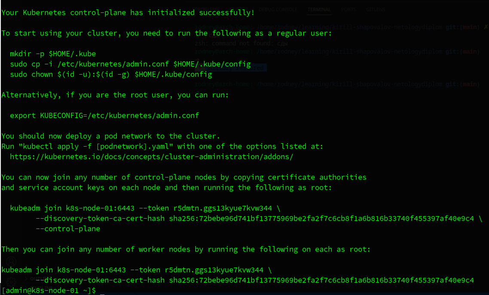
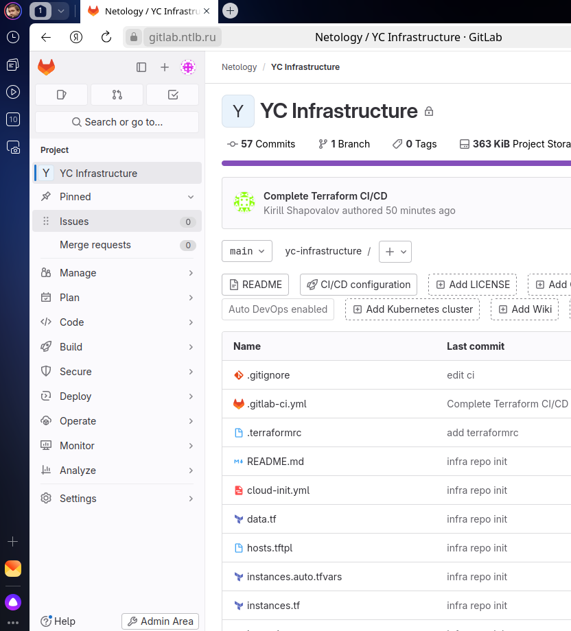
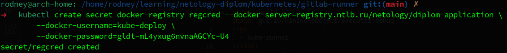

# Дипломная работа по курсу DevOPS-инженер

<br />

## Выполнил студент группы DevOPS-25 - Кирилл Шаповалов

<br />

### Структура репозитория


1. Каталог <a href="./diplom.tf/">diplom.tf</a> содержит все манифесты Terraform по созданию инфраструктуры в Yandex.Cloud, внутри находится Readme с версиями используемых провайдеров, версией самого Terraform, а также с описанием всех переменных.
2. В каталоге <a href="./ansible-playbook/">ansible-playbook</a> находится Playbook, выполняющий всю подготовительную работу на `Kubernetes Nodes` для установки и инициализации самого кластера. `Inventory-file`, а также `Groupvars-file`, являются динамическими и создаются при создании инфраструктуры с помощью Terraform. Внутри находится Readme с описанием.
3. Каталог <a href="./kubernetes/">kubernetes</a> содержит все манифесты Kubernetes для деплоя разных приложений в кластер.
4. В каталоге <a href="./diplom-app/">diplom-app</a> находится тестовое приложение, написанное на фреймворке Django, которое будет собираться в Docker-Image для последующего деплоя в кластер Kubernetes.

<br />

### Введение

В современных условиях IT-мира в России по-прежнему преобладает использование `Self-Hosted Kubernetes Cluster`, так как такое решение удовлетворяет требованиям различных служб безопасности внутри компаний, поскольку обеспечивает наилучшую сохранность персональных данных и коммерческой тайны. Потому для написания данного дипломного проекта я заранее выбрал, что буду использовать самостоятельную установку Kubernetes-кластера, не используя Managed Service for Kubernetes от облачного провайдера.

Вся инфраструктура создается с помощью Terraform, state-файл хранится в S3 бакете с возможностью блокировки с помощью Yandex DynamoDB. Хранение state файла также можно организовать внутри корпоративного Gitlab и подключать по HTTP. Более детально я рассмотрю создание инфраструктуры в соответствующем разделе.

Далее всю подготовку виртуальных машин осуществляет Ansible Playbook, написанный мной ранее для выполнения домашних заданий, который я немного модернизировал для дипломного проекта (например, подключил динамически создаваемый Inventory, добавил редактирование файла `/etc/hosts` на каждой ноде кластера).

Инициализацию кластера я выполняю самостоятельно и в ручном режиме с обязательным указанием параметра `--v=5`, поскольку для меня важно видеть что происходит в процессе инициализации кластера с выводом в консоль этапов инициализации. Для полной автоматизации можно использовать такое решение, как kubespray, но я предпочитаю осуществлять инициализацию вручную.

В качестве собственного приложения буду использовать небольшую галерею изображений, созданную с помощью фреймворка Django в процессе его изучения, соберу Docker Image, который будет храниться в локальном Gitlab Container Registry, и будет использоваться при деплое в Kubernetes кластер.

Автоматизация сборки, деплоя приложения, настройки кластера и создания инфраструктуры будет осуществлена с помощью локальной Gitlab CI/CD.

<br />

### Предварительная подготовка

При подготовке проекта были использованы локально установленные пакеты: 


<br />

### Подготовка инфраструктуры на базе облачного провайдера Yandex.Cloud

Для хранения state-файла создано S3 хранилище в Yandex.Cloud:


Для блокировки state-файла используется Yandex DynamoDB:


Проверка, что в БД реально пишется блокировка файла состояний:


<br />

Теперь рассмотрим структуру проекта по созданию инфраструктуры.

Манифест `provider.tf` описывает параметры провайдера, также здесь описано какой backend использовать для хранения tfstate файла и каким образом осуществлять его блокировку.

<details><summary><b>provider.tf</b></summary>

```terraform
terraform {
  required_providers {
    yandex = {
      source = "yandex-cloud/yandex"
    }
  }
  required_version = ">=0.107.0"

  backend "s3" {
    endpoints = {
      s3       = "https://storage.yandexcloud.net"
      dynamodb = "https://docapi.serverless.yandexcloud.net/ru-central1/b1gqm95h91idg2ffi5la/etne4c7rs7nm1h1uh5f6"
    }
    bucket                      = "net-s3-tfstate"
    region                      = "ru-central1"
    key                         = "terraform.tfstate"
    skip_region_validation      = true
    skip_credentials_validation = true
    skip_requesting_account_id  = true
    skip_s3_checksum            = true

    dynamodb_table = "lock-table"
  }
}

provider "yandex" {
  token     = var.token
  cloud_id  = var.cloud_id
  folder_id = var.folder_id
  zone      = var.default_zone
}
```

</details>

<br />

Для дипломного проекта я создал отдельную vpc с отдельной подсетью, для этого используется манифест `vpc.tf`

<details><summary><b>vpc.tf</b></summary>

```terraform
resource "yandex_vpc_network" "cloud-network" {
  name      = var.vpc_name
  folder_id = var.folder_id
}

resource "yandex_vpc_subnet" "vpc-subnet" {
  name           = var.subnet_name
  zone           = var.subnet_zone
  network_id     = yandex_vpc_network.cloud-network.id
  v4_cidr_blocks = var.cidr_block
}

```

</details>

Все параметры для создания сети и подсети задаются в файле `vpc.auto.tfvars`.

Манифест `instances.tf` динамически создает заданное количество нод будущего кластера. С помощью конструкции `for_each` можно создать как одну машину, так и 10, и больше.

<details><summary><b>instances.tf</b></summary>

```terraform
resource "yandex_compute_instance" "kube-node" {
  for_each = { for key, value in var.hostname : key => value }

  name        = each.value.hostname
  hostname    = each.value.hostname
  platform_id = var.platform
  zone        = var.default_zone

  resources {
    cores         = var.vcpu_cores
    core_fraction = var.vcpu_fraction
    memory        = var.ram_size
  }

  boot_disk {
    initialize_params {
      image_id = data.yandex_compute_image.vm-image.id
      type     = var.hdd_type
      size     = var.hdd_size
    }
  }

  scheduling_policy {
    preemptible = var.preemptible
  }

  network_interface {
    subnet_id = yandex_vpc_subnet.vpc-subnet.id
    nat       = var.network_nat
  }

  metadata = {
    serial-port-enable = var.serial_port
    user-data          = data.template_file.cloudinit.rendered
  }

  allow_stopping_for_update = var.stop_to_update
}
```

</details>

Параметры для создания инстансов задаются в файле `instances.auto.tfvars`. 

Базовая конфигурация машин осуществляется с помощью `cloud-config` файла, в котором задается имя пользователя по умолчанию, хеш его пароля, добавляется публичная часть ssh-ключа, а также задаются пакеты, которые должны быть установлены на этапе конфигурирования машин. Синтаксис файла ниже.

<details><summary><b>cloud-init.yml</b></summary>

```yml
#cloud-config

users:
  - name: admin
    sudo: ALL=(ALL) NOPASSWD:ALL
    shell: /bin/bash
    groups: sudo
    lock_passwd: false
    # password - netology-diplom
    passwd: $6$rounds=4096$MO/C34ZjgPaA44/M$KCt8tGEsbTomnLx6/W9KlR55JJo0Bhn5aLtzse3fa5UVvFhmo4C6wzitdPRv10rtWBY0yL/zZXQqKJhMMFpEs/
    ssh_authorized_keys:
      - ${ssh_public_key}
package_update: true
package_upgrade: false
packages:
  - vim
  - yum-utils
  - curl
  - git
  - wget
```

</details>

<br />

Манифест `data.tf` содержит набор датасурсов, используемых в проекте. Тут указано какой образ использовать для создания виртуальных машин, а также какой ssh-ключ брать и откуда. Прятать публичную часть ключа за переменные или Vault не вижу особого смысла, публичная часть она на то и публичная, чтобы предоставить ее куда-либо, без компрометации приватной части ключа.

<details><summary><b>data.tf</b></summary>

```terraform
data "yandex_compute_image" "vm-image" {
  family = var.image_family
}

data "template_file" "cloudinit" {
  template = file("./cloud-init.yml")
  vars = {
    ssh_public_key = file("./key.pub")
  }
}

```

</details>

<br />

Ну а манифест `main.tf` позволяет динамически создавать файл inventory для Ansible, а так же файл group_vars, содержащий локальные адреса нод будущего кластера.

<details><summary><b>main.tf</b></summary>

```terraform
resource "local_file" "ansible-inventory" {
  content = templatefile("${path.module}/hosts.tftpl",
    {
      kube-nodes = yandex_compute_instance.kube-node
    }
  )
  filename = "../ansible-playbook/inventory/hosts.yml"
}

resource "local_file" "local-address" {
  content = templatefile("${path.module}/local-node-ip-vars.tftpl",
    {
      local-adresses = yandex_compute_instance.kube-node
    }
  )
  filename = "../ansible-playbook/group_vars/all/local_ip.yml"
}
```

</details>

Используя модуль `local_file` и разные файлы-шаблоны Terraform получает определенные данные созданных виртуальных машин и записывает их в итоговый файл на выходе.

Шаблоны файлов ниже:

* шаблон inventory файла

```
---
all:
  hosts:
    %{~ for i in kube-nodes ~}
    ${i["name"]}:
      ansible_host: ${i["network_interface"][0]["nat_ip_address"]}
    %{~ endfor ~}  
  vars:
    ansible_user: admin
```

* шаблон group_vars файла

```
---
local_ip:
  %{~ for i in local-adresses ~}
  - ${i["network_interface"][0]["ip_address"]}  ${i["name"]}
  %{~ endfor ~}
```

Значения переменных для доступа к самому облаку объявлены в файле `personal.auto.tfvars`, который в репозиторий не попадает благодаря тому, что имя этого файла содержится в файле `.gitignore`. На этапе автоматизации с помощью CI/CD эти переменные нужно будет выносить в переменные проекта либо использовать стороннее хранилище секретов, например Hashicorp Vault.

Необходимо убедиться, что команды Terraform будут выполняться без каких-либо дополнительных действий.

<details><summary>Результат выполнения команды <b>terraform plan</b></summary>

```bash
rodney@arch-home: /home/rodney/learning/kirill-shapovalov-netologydiplom/diplom.tf git:(main) ✗ 
➜   terraform plan 
Acquiring state lock. This may take a few moments...
data.template_file.cloudinit: Reading...
data.template_file.cloudinit: Read complete after 0s [id=7dada99b1a5900b0a2447da452bf65e7ab31407994f179670fbb86b1b29b58eb]
data.yandex_compute_image.vm-image: Reading...
data.yandex_compute_image.vm-image: Read complete after 1s [id=fd8aptfr48hdvlflumbe]

Terraform used the selected providers to generate the following execution plan. Resource actions are indicated with the following symbols:
  + create

Terraform will perform the following actions:

  # local_file.ansible-inventory will be created
  + resource "local_file" "ansible-inventory" {
      + content              = (known after apply)
      + content_base64sha256 = (known after apply)
      + content_base64sha512 = (known after apply)
      + content_md5          = (known after apply)
      + content_sha1         = (known after apply)
      + content_sha256       = (known after apply)
      + content_sha512       = (known after apply)
      + directory_permission = "0777"
      + file_permission      = "0777"
      + filename             = "../ansible-playbook/inventory/hosts.yml"
      + id                   = (known after apply)
    }

  # local_file.local-address will be created
  + resource "local_file" "local-address" {
      + content              = (known after apply)
      + content_base64sha256 = (known after apply)
      + content_base64sha512 = (known after apply)
      + content_md5          = (known after apply)
      + content_sha1         = (known after apply)
      + content_sha256       = (known after apply)
      + content_sha512       = (known after apply)
      + directory_permission = "0777"
      + file_permission      = "0777"
      + filename             = "../ansible-playbook/group_vars/all/local_ip.yml"
      + id                   = (known after apply)
    }

  # yandex_compute_instance.kube-node["0"] will be created
  + resource "yandex_compute_instance" "kube-node" {
      + allow_stopping_for_update = true
      + created_at                = (known after apply)
      + folder_id                 = (known after apply)
      + fqdn                      = (known after apply)
      + gpu_cluster_id            = (known after apply)
      + hostname                  = "k8s-node-01"
      + id                        = (known after apply)
      + maintenance_grace_period  = (known after apply)
      + maintenance_policy        = (known after apply)
      + metadata                  = {
          + "serial-port-enable" = "1"
          + "user-data"          = <<-EOT
                #cloud-config
                
                users:
                  - name: admin
                    sudo: ALL=(ALL) NOPASSWD:ALL
                    shell: /bin/bash
                    groups: sudo
                    lock_passwd: false
                    # password - netology-diplom
                    passwd: $6$rounds=4096$MO/C34ZjgPaA44/M$KCt8tGEsbTomnLx6/W9KlR55JJo0Bhn5aLtzse3fa5UVvFhmo4C6wzitdPRv10rtWBY0yL/zZXQqKJhMMFpEs/
                    ssh_authorized_keys:
                      - ssh-ed25519 AAAAC3NzaC1lZDI1NTE5AAAAILJpYQT/m1O5e6S0I3H/lGHgzN/JYD2DzLksszQ4/GxD rodney@arch-home
                
                package_update: true
                package_upgrade: false
                packages:
                  - vim
                  - yum-utils
                  - curl
                  - git
                  - wget
            EOT
        }
      + name                      = "k8s-node-01"
      + network_acceleration_type = "standard"
      + platform_id               = "standard-v1"
      + service_account_id        = (known after apply)
      + status                    = (known after apply)
      + zone                      = "ru-central1-a"

      + boot_disk {
          + auto_delete = true
          + device_name = (known after apply)
          + disk_id     = (known after apply)
          + mode        = (known after apply)

          + initialize_params {
              + block_size  = (known after apply)
              + description = (known after apply)
              + image_id    = "fd8aptfr48hdvlflumbe"
              + name        = (known after apply)
              + size        = 20
              + snapshot_id = (known after apply)
              + type        = "network-ssd"
            }
        }

      + network_interface {
          + index              = (known after apply)
          + ip_address         = (known after apply)
          + ipv4               = true
          + ipv6               = (known after apply)
          + ipv6_address       = (known after apply)
          + mac_address        = (known after apply)
          + nat                = true
          + nat_ip_address     = (known after apply)
          + nat_ip_version     = (known after apply)
          + security_group_ids = (known after apply)
          + subnet_id          = (known after apply)
        }

      + resources {
          + core_fraction = 20
          + cores         = 4
          + memory        = 8
        }

      + scheduling_policy {
          + preemptible = true
        }
    }

  # yandex_compute_instance.kube-node["1"] will be created
  + resource "yandex_compute_instance" "kube-node" {
      + allow_stopping_for_update = true
      + created_at                = (known after apply)
      + folder_id                 = (known after apply)
      + fqdn                      = (known after apply)
      + gpu_cluster_id            = (known after apply)
      + hostname                  = "k8s-node-02"
      + id                        = (known after apply)
      + maintenance_grace_period  = (known after apply)
      + maintenance_policy        = (known after apply)
      + metadata                  = {
          + "serial-port-enable" = "1"
          + "user-data"          = <<-EOT
                #cloud-config
                
                users:
                  - name: admin
                    sudo: ALL=(ALL) NOPASSWD:ALL
                    shell: /bin/bash
                    groups: sudo
                    lock_passwd: false
                    # password - netology-diplom
                    passwd: $6$rounds=4096$MO/C34ZjgPaA44/M$KCt8tGEsbTomnLx6/W9KlR55JJo0Bhn5aLtzse3fa5UVvFhmo4C6wzitdPRv10rtWBY0yL/zZXQqKJhMMFpEs/
                    ssh_authorized_keys:
                      - ssh-ed25519 AAAAC3NzaC1lZDI1NTE5AAAAILJpYQT/m1O5e6S0I3H/lGHgzN/JYD2DzLksszQ4/GxD rodney@arch-home
                
                package_update: true
                package_upgrade: false
                packages:
                  - vim
                  - yum-utils
                  - curl
                  - git
                  - wget
            EOT
        }
      + name                      = "k8s-node-02"
      + network_acceleration_type = "standard"
      + platform_id               = "standard-v1"
      + service_account_id        = (known after apply)
      + status                    = (known after apply)
      + zone                      = "ru-central1-a"

      + boot_disk {
          + auto_delete = true
          + device_name = (known after apply)
          + disk_id     = (known after apply)
          + mode        = (known after apply)

          + initialize_params {
              + block_size  = (known after apply)
              + description = (known after apply)
              + image_id    = "fd8aptfr48hdvlflumbe"
              + name        = (known after apply)
              + size        = 20
              + snapshot_id = (known after apply)
              + type        = "network-ssd"
            }
        }

      + network_interface {
          + index              = (known after apply)
          + ip_address         = (known after apply)
          + ipv4               = true
          + ipv6               = (known after apply)
          + ipv6_address       = (known after apply)
          + mac_address        = (known after apply)
          + nat                = true
          + nat_ip_address     = (known after apply)
          + nat_ip_version     = (known after apply)
          + security_group_ids = (known after apply)
          + subnet_id          = (known after apply)
        }

      + resources {
          + core_fraction = 20
          + cores         = 4
          + memory        = 8
        }

      + scheduling_policy {
          + preemptible = true
        }
    }

  # yandex_compute_instance.kube-node["2"] will be created
  + resource "yandex_compute_instance" "kube-node" {
      + allow_stopping_for_update = true
      + created_at                = (known after apply)
      + folder_id                 = (known after apply)
      + fqdn                      = (known after apply)
      + gpu_cluster_id            = (known after apply)
      + hostname                  = "k8s-node-03"
      + id                        = (known after apply)
      + maintenance_grace_period  = (known after apply)
      + maintenance_policy        = (known after apply)
      + metadata                  = {
          + "serial-port-enable" = "1"
          + "user-data"          = <<-EOT
                #cloud-config
                
                users:
                  - name: admin
                    sudo: ALL=(ALL) NOPASSWD:ALL
                    shell: /bin/bash
                    groups: sudo
                    lock_passwd: false
                    # password - netology-diplom
                    passwd: $6$rounds=4096$MO/C34ZjgPaA44/M$KCt8tGEsbTomnLx6/W9KlR55JJo0Bhn5aLtzse3fa5UVvFhmo4C6wzitdPRv10rtWBY0yL/zZXQqKJhMMFpEs/
                    ssh_authorized_keys:
                      - ssh-ed25519 AAAAC3NzaC1lZDI1NTE5AAAAILJpYQT/m1O5e6S0I3H/lGHgzN/JYD2DzLksszQ4/GxD rodney@arch-home
                
                package_update: true
                package_upgrade: false
                packages:
                  - vim
                  - yum-utils
                  - curl
                  - git
                  - wget
            EOT
        }
      + name                      = "k8s-node-03"
      + network_acceleration_type = "standard"
      + platform_id               = "standard-v1"
      + service_account_id        = (known after apply)
      + status                    = (known after apply)
      + zone                      = "ru-central1-a"

      + boot_disk {
          + auto_delete = true
          + device_name = (known after apply)
          + disk_id     = (known after apply)
          + mode        = (known after apply)

          + initialize_params {
              + block_size  = (known after apply)
              + description = (known after apply)
              + image_id    = "fd8aptfr48hdvlflumbe"
              + name        = (known after apply)
              + size        = 20
              + snapshot_id = (known after apply)
              + type        = "network-ssd"
            }
        }

      + network_interface {
          + index              = (known after apply)
          + ip_address         = (known after apply)
          + ipv4               = true
          + ipv6               = (known after apply)
          + ipv6_address       = (known after apply)
          + mac_address        = (known after apply)
          + nat                = true
          + nat_ip_address     = (known after apply)
          + nat_ip_version     = (known after apply)
          + security_group_ids = (known after apply)
          + subnet_id          = (known after apply)
        }

      + resources {
          + core_fraction = 20
          + cores         = 4
          + memory        = 8
        }

      + scheduling_policy {
          + preemptible = true
        }
    }

  # yandex_vpc_network.cloud-network will be created
  + resource "yandex_vpc_network" "cloud-network" {
      + created_at                = (known after apply)
      + default_security_group_id = (known after apply)
      + folder_id                 = "b1gab8fuc9s78vrid6au"
      + id                        = (known after apply)
      + labels                    = (known after apply)
      + name                      = "diplom-network"
      + subnet_ids                = (known after apply)
    }

  # yandex_vpc_subnet.vpc-subnet will be created
  + resource "yandex_vpc_subnet" "vpc-subnet" {
      + created_at     = (known after apply)
      + folder_id      = (known after apply)
      + id             = (known after apply)
      + labels         = (known after apply)
      + name           = "public"
      + network_id     = (known after apply)
      + v4_cidr_blocks = [
          + "192.168.10.0/24",
        ]
      + v6_cidr_blocks = (known after apply)
      + zone           = "ru-central1-a"
    }

Plan: 7 to add, 0 to change, 0 to destroy.

─────────────────────────────────────────────────────────────────────────────────────────────────────────────────────────────────────────────────────────────────────────────────────────────────────────────────────────────────────────────────────────────

Note: You didn't use the -out option to save this plan, so Terraform can't guarantee to take exactly these actions if you run "terraform apply" now.
```

</details>

<br />

<details><summary>Результат выполнения команды <b>terraform apply</b></summary>

```bash
rodney@arch-home: /home/rodney/learning/kirill-shapovalov-netologydiplom/diplom.tf git:(main) ✗ 
➜   terraform apply       
data.template_file.cloudinit: Reading...
data.template_file.cloudinit: Read complete after 0s [id=7dada99b1a5900b0a2447da452bf65e7ab31407994f179670fbb86b1b29b58eb]
data.yandex_compute_image.vm-image: Reading...
data.yandex_compute_image.vm-image: Read complete after 1s [id=fd8aptfr48hdvlflumbe]

Terraform used the selected providers to generate the following execution plan. Resource actions are indicated with the following symbols:
  + create

Terraform will perform the following actions:

  # local_file.ansible-inventory will be created
  + resource "local_file" "ansible-inventory" {
      + content              = (known after apply)
      + content_base64sha256 = (known after apply)
      + content_base64sha512 = (known after apply)
      + content_md5          = (known after apply)
      + content_sha1         = (known after apply)
      + content_sha256       = (known after apply)
      + content_sha512       = (known after apply)
      + directory_permission = "0777"
      + file_permission      = "0777"
      + filename             = "../ansible-playbook/inventory/hosts.yml"
      + id                   = (known after apply)
    }

  # local_file.local-address will be created
  + resource "local_file" "local-address" {
      + content              = (known after apply)
      + content_base64sha256 = (known after apply)
      + content_base64sha512 = (known after apply)
      + content_md5          = (known after apply)
      + content_sha1         = (known after apply)
      + content_sha256       = (known after apply)
      + content_sha512       = (known after apply)
      + directory_permission = "0777"
      + file_permission      = "0777"
      + filename             = "../ansible-playbook/group_vars/all/local_ip.yml"
      + id                   = (known after apply)
    }

  # yandex_compute_instance.kube-node["0"] will be created
  + resource "yandex_compute_instance" "kube-node" {
      + allow_stopping_for_update = true
      + created_at                = (known after apply)
      + folder_id                 = (known after apply)
      + fqdn                      = (known after apply)
      + gpu_cluster_id            = (known after apply)
      + hostname                  = "k8s-node-01"
      + id                        = (known after apply)
      + maintenance_grace_period  = (known after apply)
      + maintenance_policy        = (known after apply)
      + metadata                  = {
          + "serial-port-enable" = "1"
          + "user-data"          = <<-EOT
                #cloud-config
                
                users:
                  - name: admin
                    sudo: ALL=(ALL) NOPASSWD:ALL
                    shell: /bin/bash
                    groups: sudo
                    lock_passwd: false
                    # password - netology-diplom
                    passwd: $6$rounds=4096$MO/C34ZjgPaA44/M$KCt8tGEsbTomnLx6/W9KlR55JJo0Bhn5aLtzse3fa5UVvFhmo4C6wzitdPRv10rtWBY0yL/zZXQqKJhMMFpEs/
                    ssh_authorized_keys:
                      - ssh-ed25519 AAAAC3NzaC1lZDI1NTE5AAAAILJpYQT/m1O5e6S0I3H/lGHgzN/JYD2DzLksszQ4/GxD rodney@arch-home
                
                package_update: true
                package_upgrade: false
                packages:
                  - vim
                  - yum-utils
                  - curl
                  - git
                  - wget
            EOT
        }
      + name                      = "k8s-node-01"
      + network_acceleration_type = "standard"
      + platform_id               = "standard-v1"
      + service_account_id        = (known after apply)
      + status                    = (known after apply)
      + zone                      = "ru-central1-a"

      + boot_disk {
          + auto_delete = true
          + device_name = (known after apply)
          + disk_id     = (known after apply)
          + mode        = (known after apply)

          + initialize_params {
              + block_size  = (known after apply)
              + description = (known after apply)
              + image_id    = "fd8aptfr48hdvlflumbe"
              + name        = (known after apply)
              + size        = 20
              + snapshot_id = (known after apply)
              + type        = "network-ssd"
            }
        }

      + network_interface {
          + index              = (known after apply)
          + ip_address         = (known after apply)
          + ipv4               = true
          + ipv6               = (known after apply)
          + ipv6_address       = (known after apply)
          + mac_address        = (known after apply)
          + nat                = true
          + nat_ip_address     = (known after apply)
          + nat_ip_version     = (known after apply)
          + security_group_ids = (known after apply)
          + subnet_id          = (known after apply)
        }

      + resources {
          + core_fraction = 20
          + cores         = 4
          + memory        = 8
        }

      + scheduling_policy {
          + preemptible = true
        }
    }

  # yandex_compute_instance.kube-node["1"] will be created
  + resource "yandex_compute_instance" "kube-node" {
      + allow_stopping_for_update = true
      + created_at                = (known after apply)
      + folder_id                 = (known after apply)
      + fqdn                      = (known after apply)
      + gpu_cluster_id            = (known after apply)
      + hostname                  = "k8s-node-02"
      + id                        = (known after apply)
      + maintenance_grace_period  = (known after apply)
      + maintenance_policy        = (known after apply)
      + metadata                  = {
          + "serial-port-enable" = "1"
          + "user-data"          = <<-EOT
                #cloud-config
                
                users:
                  - name: admin
                    sudo: ALL=(ALL) NOPASSWD:ALL
                    shell: /bin/bash
                    groups: sudo
                    lock_passwd: false
                    # password - netology-diplom
                    passwd: $6$rounds=4096$MO/C34ZjgPaA44/M$KCt8tGEsbTomnLx6/W9KlR55JJo0Bhn5aLtzse3fa5UVvFhmo4C6wzitdPRv10rtWBY0yL/zZXQqKJhMMFpEs/
                    ssh_authorized_keys:
                      - ssh-ed25519 AAAAC3NzaC1lZDI1NTE5AAAAILJpYQT/m1O5e6S0I3H/lGHgzN/JYD2DzLksszQ4/GxD rodney@arch-home
                
                package_update: true
                package_upgrade: false
                packages:
                  - vim
                  - yum-utils
                  - curl
                  - git
                  - wget
            EOT
        }
      + name                      = "k8s-node-02"
      + network_acceleration_type = "standard"
      + platform_id               = "standard-v1"
      + service_account_id        = (known after apply)
      + status                    = (known after apply)
      + zone                      = "ru-central1-a"

      + boot_disk {
          + auto_delete = true
          + device_name = (known after apply)
          + disk_id     = (known after apply)
          + mode        = (known after apply)

          + initialize_params {
              + block_size  = (known after apply)
              + description = (known after apply)
              + image_id    = "fd8aptfr48hdvlflumbe"
              + name        = (known after apply)
              + size        = 20
              + snapshot_id = (known after apply)
              + type        = "network-ssd"
            }
        }

      + network_interface {
          + index              = (known after apply)
          + ip_address         = (known after apply)
          + ipv4               = true
          + ipv6               = (known after apply)
          + ipv6_address       = (known after apply)
          + mac_address        = (known after apply)
          + nat                = true
          + nat_ip_address     = (known after apply)
          + nat_ip_version     = (known after apply)
          + security_group_ids = (known after apply)
          + subnet_id          = (known after apply)
        }

      + resources {
          + core_fraction = 20
          + cores         = 4
          + memory        = 8
        }

      + scheduling_policy {
          + preemptible = true
        }
    }

  # yandex_compute_instance.kube-node["2"] will be created
  + resource "yandex_compute_instance" "kube-node" {
      + allow_stopping_for_update = true
      + created_at                = (known after apply)
      + folder_id                 = (known after apply)
      + fqdn                      = (known after apply)
      + gpu_cluster_id            = (known after apply)
      + hostname                  = "k8s-node-03"
      + id                        = (known after apply)
      + maintenance_grace_period  = (known after apply)
      + maintenance_policy        = (known after apply)
      + metadata                  = {
          + "serial-port-enable" = "1"
          + "user-data"          = <<-EOT
                #cloud-config
                
                users:
                  - name: admin
                    sudo: ALL=(ALL) NOPASSWD:ALL
                    shell: /bin/bash
                    groups: sudo
                    lock_passwd: false
                    # password - netology-diplom
                    passwd: $6$rounds=4096$MO/C34ZjgPaA44/M$KCt8tGEsbTomnLx6/W9KlR55JJo0Bhn5aLtzse3fa5UVvFhmo4C6wzitdPRv10rtWBY0yL/zZXQqKJhMMFpEs/
                    ssh_authorized_keys:
                      - ssh-ed25519 AAAAC3NzaC1lZDI1NTE5AAAAILJpYQT/m1O5e6S0I3H/lGHgzN/JYD2DzLksszQ4/GxD rodney@arch-home
                
                package_update: true
                package_upgrade: false
                packages:
                  - vim
                  - yum-utils
                  - curl
                  - git
                  - wget
            EOT
        }
      + name                      = "k8s-node-03"
      + network_acceleration_type = "standard"
      + platform_id               = "standard-v1"
      + service_account_id        = (known after apply)
      + status                    = (known after apply)
      + zone                      = "ru-central1-a"

      + boot_disk {
          + auto_delete = true
          + device_name = (known after apply)
          + disk_id     = (known after apply)
          + mode        = (known after apply)

          + initialize_params {
              + block_size  = (known after apply)
              + description = (known after apply)
              + image_id    = "fd8aptfr48hdvlflumbe"
              + name        = (known after apply)
              + size        = 20
              + snapshot_id = (known after apply)
              + type        = "network-ssd"
            }
        }

      + network_interface {
          + index              = (known after apply)
          + ip_address         = (known after apply)
          + ipv4               = true
          + ipv6               = (known after apply)
          + ipv6_address       = (known after apply)
          + mac_address        = (known after apply)
          + nat                = true
          + nat_ip_address     = (known after apply)
          + nat_ip_version     = (known after apply)
          + security_group_ids = (known after apply)
          + subnet_id          = (known after apply)
        }

      + resources {
          + core_fraction = 20
          + cores         = 4
          + memory        = 8
        }

      + scheduling_policy {
          + preemptible = true
        }
    }

  # yandex_vpc_network.cloud-network will be created
  + resource "yandex_vpc_network" "cloud-network" {
      + created_at                = (known after apply)
      + default_security_group_id = (known after apply)
      + folder_id                 = "b1gab8fuc9s78vrid6au"
      + id                        = (known after apply)
      + labels                    = (known after apply)
      + name                      = "diplom-network"
      + subnet_ids                = (known after apply)
    }

  # yandex_vpc_subnet.vpc-subnet will be created
  + resource "yandex_vpc_subnet" "vpc-subnet" {
      + created_at     = (known after apply)
      + folder_id      = (known after apply)
      + id             = (known after apply)
      + labels         = (known after apply)
      + name           = "public"
      + network_id     = (known after apply)
      + v4_cidr_blocks = [
          + "192.168.10.0/24",
        ]
      + v6_cidr_blocks = (known after apply)
      + zone           = "ru-central1-a"
    }

Plan: 7 to add, 0 to change, 0 to destroy.

Do you want to perform these actions?
  Terraform will perform the actions described above.
  Only 'yes' will be accepted to approve.

  Enter a value: yes

yandex_vpc_network.cloud-network: Creating...
yandex_vpc_network.cloud-network: Creation complete after 4s [id=enpcbmbsdf2fte3nksus]
yandex_vpc_subnet.vpc-subnet: Creating...
yandex_vpc_subnet.vpc-subnet: Creation complete after 0s [id=e9biu29uda5nk2ds9267]
yandex_compute_instance.kube-node["2"]: Creating...
yandex_compute_instance.kube-node["1"]: Creating...
yandex_compute_instance.kube-node["0"]: Creating...
yandex_compute_instance.kube-node["2"]: Still creating... [10s elapsed]
yandex_compute_instance.kube-node["1"]: Still creating... [10s elapsed]
yandex_compute_instance.kube-node["0"]: Still creating... [10s elapsed]
yandex_compute_instance.kube-node["1"]: Still creating... [20s elapsed]
yandex_compute_instance.kube-node["2"]: Still creating... [20s elapsed]
yandex_compute_instance.kube-node["0"]: Still creating... [20s elapsed]
yandex_compute_instance.kube-node["2"]: Still creating... [30s elapsed]
yandex_compute_instance.kube-node["1"]: Still creating... [30s elapsed]
yandex_compute_instance.kube-node["0"]: Still creating... [30s elapsed]
yandex_compute_instance.kube-node["0"]: Creation complete after 31s [id=fhm7ge0kaj4ehteell84]
yandex_compute_instance.kube-node["1"]: Creation complete after 35s [id=fhmd254ti1ve9fer4sfu]
yandex_compute_instance.kube-node["2"]: Creation complete after 38s [id=fhm21gp5hscbenqkb5oe]
local_file.ansible-inventory: Creating...
local_file.local-address: Creating...
local_file.ansible-inventory: Creation complete after 0s [id=0636557ffce5d790bacb805764b68ffdcb4bc010]
local_file.local-address: Creation complete after 0s [id=70783904d03169065aadd905fda70b7ceee3b4b7]

Apply complete! Resources: 7 added, 0 changed, 0 destroyed.
```

</details>

<br />

<details><summary>Результат выполнения команды <b>terraform destroy</b></summary>

```bash
rodney@arch-home: /home/rodney/learning/kirill-shapovalov-netologydiplom/diplom.tf git:(main) ✗ 
➜   terraform destroy
data.template_file.cloudinit: Reading...
data.template_file.cloudinit: Read complete after 0s [id=7dada99b1a5900b0a2447da452bf65e7ab31407994f179670fbb86b1b29b58eb]
yandex_vpc_network.cloud-network: Refreshing state... [id=enpcbmbsdf2fte3nksus]
data.yandex_compute_image.vm-image: Reading...
data.yandex_compute_image.vm-image: Read complete after 1s [id=fd8aptfr48hdvlflumbe]
yandex_vpc_subnet.vpc-subnet: Refreshing state... [id=e9biu29uda5nk2ds9267]
yandex_compute_instance.kube-node["1"]: Refreshing state... [id=fhmd254ti1ve9fer4sfu]
yandex_compute_instance.kube-node["2"]: Refreshing state... [id=fhm21gp5hscbenqkb5oe]
yandex_compute_instance.kube-node["0"]: Refreshing state... [id=fhm7ge0kaj4ehteell84]
local_file.ansible-inventory: Refreshing state... [id=0636557ffce5d790bacb805764b68ffdcb4bc010]
local_file.local-address: Refreshing state... [id=70783904d03169065aadd905fda70b7ceee3b4b7]

Terraform used the selected providers to generate the following execution plan. Resource actions are indicated with the following symbols:
  - destroy

Terraform will perform the following actions:

  # local_file.ansible-inventory will be destroyed
  - resource "local_file" "ansible-inventory" {
      - content              = <<-EOT
            ---
            all:
              hosts:
                k8s-node-01:
                  ansible_host: 158.160.121.191
                k8s-node-02:
                  ansible_host: 62.84.115.190
                k8s-node-03:
                  ansible_host: 51.250.10.89
              vars:
                ansible_user: admin
        EOT -> null
      - content_base64sha256 = "u6Fs6QE5Q/zCpTEMOLyk4nl93HwOV9puWcRJj/y6sbI=" -> null
      - content_base64sha512 = "mvwihMMJomvOVJx/vZl7kzZhUMZW/cZzli+BdhjJK8sqx1PZXpP5eVfD24R9VWRlpqb57PrKv2dgKrLUZhK69A==" -> null
      - content_md5          = "5a029cc679e7c11afcf2f56f4f7cbf0d" -> null
      - content_sha1         = "0636557ffce5d790bacb805764b68ffdcb4bc010" -> null
      - content_sha256       = "bba16ce9013943fcc2a5310c38bca4e2797ddc7c0e57da6e59c4498ffcbab1b2" -> null
      - content_sha512       = "9afc2284c309a26bce549c7fbd997b93366150c656fdc673962f817618c92bcb2ac753d95e93f97957c3db847d556465a6a6f9ecfacabf67602ab2d46612baf4" -> null
      - directory_permission = "0777" -> null
      - file_permission      = "0777" -> null
      - filename             = "../ansible-playbook/inventory/hosts.yml" -> null
      - id                   = "0636557ffce5d790bacb805764b68ffdcb4bc010" -> null
    }

  # local_file.local-address will be destroyed
  - resource "local_file" "local-address" {
      - content              = <<-EOT
            ---
            local_ip:
              - 192.168.10.3  k8s-node-01
              - 192.168.10.15  k8s-node-02
              - 192.168.10.26  k8s-node-03
        EOT -> null
      - content_base64sha256 = "bYlR/X4llYqf5ZdfHXwAWL74SiRq8opO5FOQiKTiEZU=" -> null
      - content_base64sha512 = "QDnPDblJXmyGvNR46FpK8g1TfoLO2Lt5cyYflG9BjBbrAhfnp2XMMHxOCZvLv0YHeITEgp6RUM+gEmeBHlIqIQ==" -> null
      - content_md5          = "e38ab4e4df6377400ca4973efc7676c5" -> null
      - content_sha1         = "70783904d03169065aadd905fda70b7ceee3b4b7" -> null
      - content_sha256       = "6d8951fd7e25958a9fe5975f1d7c0058bef84a246af28a4ee4539088a4e21195" -> null
      - content_sha512       = "4039cf0db9495e6c86bcd478e85a4af20d537e82ced8bb7973261f946f418c16eb0217e7a765cc307c4e099bcbbf46077884c4829e9150cfa01267811e522a21" -> null
      - directory_permission = "0777" -> null
      - file_permission      = "0777" -> null
      - filename             = "../ansible-playbook/group_vars/all/local_ip.yml" -> null
      - id                   = "70783904d03169065aadd905fda70b7ceee3b4b7" -> null
    }

  # yandex_compute_instance.kube-node["0"] will be destroyed
  - resource "yandex_compute_instance" "kube-node" {
      - allow_stopping_for_update = true -> null
      - created_at                = "2024-02-22T14:54:51Z" -> null
      - folder_id                 = "b1gab8fuc9s78vrid6au" -> null
      - fqdn                      = "k8s-node-01.ru-central1.internal" -> null
      - hostname                  = "k8s-node-01" -> null
      - id                        = "fhm7ge0kaj4ehteell84" -> null
      - labels                    = {} -> null
      - metadata                  = {
          - "serial-port-enable" = "1"
          - "user-data"          = <<-EOT
                #cloud-config
                
                users:
                  - name: admin
                    sudo: ALL=(ALL) NOPASSWD:ALL
                    shell: /bin/bash
                    groups: sudo
                    lock_passwd: false
                    # password - netology-diplom
                    passwd: $6$rounds=4096$MO/C34ZjgPaA44/M$KCt8tGEsbTomnLx6/W9KlR55JJo0Bhn5aLtzse3fa5UVvFhmo4C6wzitdPRv10rtWBY0yL/zZXQqKJhMMFpEs/
                    ssh_authorized_keys:
                      - ssh-ed25519 AAAAC3NzaC1lZDI1NTE5AAAAILJpYQT/m1O5e6S0I3H/lGHgzN/JYD2DzLksszQ4/GxD rodney@arch-home
                
                package_update: true
                package_upgrade: false
                packages:
                  - vim
                  - yum-utils
                  - curl
                  - git
                  - wget
            EOT
        } -> null
      - name                      = "k8s-node-01" -> null
      - network_acceleration_type = "standard" -> null
      - platform_id               = "standard-v1" -> null
      - status                    = "running" -> null
      - zone                      = "ru-central1-a" -> null

      - boot_disk {
          - auto_delete = true -> null
          - device_name = "fhml6jqgdv8csumj8b8s" -> null
          - disk_id     = "fhml6jqgdv8csumj8b8s" -> null
          - mode        = "READ_WRITE" -> null

          - initialize_params {
              - block_size = 4096 -> null
              - image_id   = "fd8aptfr48hdvlflumbe" -> null
              - size       = 20 -> null
              - type       = "network-ssd" -> null
            }
        }

      - metadata_options {
          - aws_v1_http_endpoint = 1 -> null
          - aws_v1_http_token    = 2 -> null
          - gce_http_endpoint    = 1 -> null
          - gce_http_token       = 1 -> null
        }

      - network_interface {
          - index              = 0 -> null
          - ip_address         = "192.168.10.3" -> null
          - ipv4               = true -> null
          - ipv6               = false -> null
          - mac_address        = "d0:0d:78:38:14:54" -> null
          - nat                = true -> null
          - nat_ip_address     = "158.160.121.191" -> null
          - nat_ip_version     = "IPV4" -> null
          - security_group_ids = [] -> null
          - subnet_id          = "e9biu29uda5nk2ds9267" -> null
        }

      - placement_policy {
          - host_affinity_rules       = [] -> null
          - placement_group_partition = 0 -> null
        }

      - resources {
          - core_fraction = 20 -> null
          - cores         = 4 -> null
          - gpus          = 0 -> null
          - memory        = 8 -> null
        }

      - scheduling_policy {
          - preemptible = true -> null
        }
    }

  # yandex_compute_instance.kube-node["1"] will be destroyed
  - resource "yandex_compute_instance" "kube-node" {
      - allow_stopping_for_update = true -> null
      - created_at                = "2024-02-22T14:54:51Z" -> null
      - folder_id                 = "b1gab8fuc9s78vrid6au" -> null
      - fqdn                      = "k8s-node-02.ru-central1.internal" -> null
      - hostname                  = "k8s-node-02" -> null
      - id                        = "fhmd254ti1ve9fer4sfu" -> null
      - labels                    = {} -> null
      - metadata                  = {
          - "serial-port-enable" = "1"
          - "user-data"          = <<-EOT
                #cloud-config
                
                users:
                  - name: admin
                    sudo: ALL=(ALL) NOPASSWD:ALL
                    shell: /bin/bash
                    groups: sudo
                    lock_passwd: false
                    # password - netology-diplom
                    passwd: $6$rounds=4096$MO/C34ZjgPaA44/M$KCt8tGEsbTomnLx6/W9KlR55JJo0Bhn5aLtzse3fa5UVvFhmo4C6wzitdPRv10rtWBY0yL/zZXQqKJhMMFpEs/
                    ssh_authorized_keys:
                      - ssh-ed25519 AAAAC3NzaC1lZDI1NTE5AAAAILJpYQT/m1O5e6S0I3H/lGHgzN/JYD2DzLksszQ4/GxD rodney@arch-home
                
                package_update: true
                package_upgrade: false
                packages:
                  - vim
                  - yum-utils
                  - curl
                  - git
                  - wget
            EOT
        } -> null
      - name                      = "k8s-node-02" -> null
      - network_acceleration_type = "standard" -> null
      - platform_id               = "standard-v1" -> null
      - status                    = "running" -> null
      - zone                      = "ru-central1-a" -> null

      - boot_disk {
          - auto_delete = true -> null
          - device_name = "fhms1hu7p3pe3m6vd413" -> null
          - disk_id     = "fhms1hu7p3pe3m6vd413" -> null
          - mode        = "READ_WRITE" -> null

          - initialize_params {
              - block_size = 4096 -> null
              - image_id   = "fd8aptfr48hdvlflumbe" -> null
              - size       = 20 -> null
              - type       = "network-ssd" -> null
            }
        }

      - metadata_options {
          - aws_v1_http_endpoint = 1 -> null
          - aws_v1_http_token    = 2 -> null
          - gce_http_endpoint    = 1 -> null
          - gce_http_token       = 1 -> null
        }

      - network_interface {
          - index              = 0 -> null
          - ip_address         = "192.168.10.15" -> null
          - ipv4               = true -> null
          - ipv6               = false -> null
          - mac_address        = "d0:0d:d1:14:9d:90" -> null
          - nat                = true -> null
          - nat_ip_address     = "62.84.115.190" -> null
          - nat_ip_version     = "IPV4" -> null
          - security_group_ids = [] -> null
          - subnet_id          = "e9biu29uda5nk2ds9267" -> null
        }

      - placement_policy {
          - host_affinity_rules       = [] -> null
          - placement_group_partition = 0 -> null
        }

      - resources {
          - core_fraction = 20 -> null
          - cores         = 4 -> null
          - gpus          = 0 -> null
          - memory        = 8 -> null
        }

      - scheduling_policy {
          - preemptible = true -> null
        }
    }

  # yandex_compute_instance.kube-node["2"] will be destroyed
  - resource "yandex_compute_instance" "kube-node" {
      - allow_stopping_for_update = true -> null
      - created_at                = "2024-02-22T14:54:51Z" -> null
      - folder_id                 = "b1gab8fuc9s78vrid6au" -> null
      - fqdn                      = "k8s-node-03.ru-central1.internal" -> null
      - hostname                  = "k8s-node-03" -> null
      - id                        = "fhm21gp5hscbenqkb5oe" -> null
      - labels                    = {} -> null
      - metadata                  = {
          - "serial-port-enable" = "1"
          - "user-data"          = <<-EOT
                #cloud-config
                
                users:
                  - name: admin
                    sudo: ALL=(ALL) NOPASSWD:ALL
                    shell: /bin/bash
                    groups: sudo
                    lock_passwd: false
                    # password - netology-diplom
                    passwd: $6$rounds=4096$MO/C34ZjgPaA44/M$KCt8tGEsbTomnLx6/W9KlR55JJo0Bhn5aLtzse3fa5UVvFhmo4C6wzitdPRv10rtWBY0yL/zZXQqKJhMMFpEs/
                    ssh_authorized_keys:
                      - ssh-ed25519 AAAAC3NzaC1lZDI1NTE5AAAAILJpYQT/m1O5e6S0I3H/lGHgzN/JYD2DzLksszQ4/GxD rodney@arch-home
                
                package_update: true
                package_upgrade: false
                packages:
                  - vim
                  - yum-utils
                  - curl
                  - git
                  - wget
            EOT
        } -> null
      - name                      = "k8s-node-03" -> null
      - network_acceleration_type = "standard" -> null
      - platform_id               = "standard-v1" -> null
      - status                    = "running" -> null
      - zone                      = "ru-central1-a" -> null

      - boot_disk {
          - auto_delete = true -> null
          - device_name = "fhmm9uljelsetquua0i2" -> null
          - disk_id     = "fhmm9uljelsetquua0i2" -> null
          - mode        = "READ_WRITE" -> null

          - initialize_params {
              - block_size = 4096 -> null
              - image_id   = "fd8aptfr48hdvlflumbe" -> null
              - size       = 20 -> null
              - type       = "network-ssd" -> null
            }
        }

      - metadata_options {
          - aws_v1_http_endpoint = 1 -> null
          - aws_v1_http_token    = 2 -> null
          - gce_http_endpoint    = 1 -> null
          - gce_http_token       = 1 -> null
        }

      - network_interface {
          - index              = 0 -> null
          - ip_address         = "192.168.10.26" -> null
          - ipv4               = true -> null
          - ipv6               = false -> null
          - mac_address        = "d0:0d:20:c3:25:8f" -> null
          - nat                = true -> null
          - nat_ip_address     = "51.250.10.89" -> null
          - nat_ip_version     = "IPV4" -> null
          - security_group_ids = [] -> null
          - subnet_id          = "e9biu29uda5nk2ds9267" -> null
        }

      - placement_policy {
          - host_affinity_rules       = [] -> null
          - placement_group_partition = 0 -> null
        }

      - resources {
          - core_fraction = 20 -> null
          - cores         = 4 -> null
          - gpus          = 0 -> null
          - memory        = 8 -> null
        }

      - scheduling_policy {
          - preemptible = true -> null
        }
    }

  # yandex_vpc_network.cloud-network will be destroyed
  - resource "yandex_vpc_network" "cloud-network" {
      - created_at                = "2024-02-22T14:54:46Z" -> null
      - default_security_group_id = "enp684trksk1a1m6mqvs" -> null
      - folder_id                 = "b1gab8fuc9s78vrid6au" -> null
      - id                        = "enpcbmbsdf2fte3nksus" -> null
      - labels                    = {} -> null
      - name                      = "diplom-network" -> null
      - subnet_ids                = [
          - "e9biu29uda5nk2ds9267",
        ] -> null
    }

  # yandex_vpc_subnet.vpc-subnet will be destroyed
  - resource "yandex_vpc_subnet" "vpc-subnet" {
      - created_at     = "2024-02-22T14:54:50Z" -> null
      - folder_id      = "b1gab8fuc9s78vrid6au" -> null
      - id             = "e9biu29uda5nk2ds9267" -> null
      - labels         = {} -> null
      - name           = "public" -> null
      - network_id     = "enpcbmbsdf2fte3nksus" -> null
      - v4_cidr_blocks = [
          - "192.168.10.0/24",
        ] -> null
      - v6_cidr_blocks = [] -> null
      - zone           = "ru-central1-a" -> null
    }

Plan: 0 to add, 0 to change, 7 to destroy.

Do you really want to destroy all resources?
  Terraform will destroy all your managed infrastructure, as shown above.
  There is no undo. Only 'yes' will be accepted to confirm.

  Enter a value: yes

local_file.ansible-inventory: Destroying... [id=0636557ffce5d790bacb805764b68ffdcb4bc010]
local_file.local-address: Destroying... [id=70783904d03169065aadd905fda70b7ceee3b4b7]
local_file.ansible-inventory: Destruction complete after 0s
local_file.local-address: Destruction complete after 0s
yandex_compute_instance.kube-node["2"]: Destroying... [id=fhm21gp5hscbenqkb5oe]
yandex_compute_instance.kube-node["0"]: Destroying... [id=fhm7ge0kaj4ehteell84]
yandex_compute_instance.kube-node["1"]: Destroying... [id=fhmd254ti1ve9fer4sfu]
yandex_compute_instance.kube-node["1"]: Still destroying... [id=fhmd254ti1ve9fer4sfu, 10s elapsed]
yandex_compute_instance.kube-node["2"]: Still destroying... [id=fhm21gp5hscbenqkb5oe, 10s elapsed]
yandex_compute_instance.kube-node["0"]: Still destroying... [id=fhm7ge0kaj4ehteell84, 10s elapsed]
yandex_compute_instance.kube-node["0"]: Still destroying... [id=fhm7ge0kaj4ehteell84, 20s elapsed]
yandex_compute_instance.kube-node["2"]: Still destroying... [id=fhm21gp5hscbenqkb5oe, 20s elapsed]
yandex_compute_instance.kube-node["1"]: Still destroying... [id=fhmd254ti1ve9fer4sfu, 20s elapsed]
yandex_compute_instance.kube-node["1"]: Still destroying... [id=fhmd254ti1ve9fer4sfu, 30s elapsed]
yandex_compute_instance.kube-node["0"]: Still destroying... [id=fhm7ge0kaj4ehteell84, 30s elapsed]
yandex_compute_instance.kube-node["2"]: Still destroying... [id=fhm21gp5hscbenqkb5oe, 30s elapsed]
yandex_compute_instance.kube-node["0"]: Destruction complete after 35s
yandex_compute_instance.kube-node["2"]: Still destroying... [id=fhm21gp5hscbenqkb5oe, 40s elapsed]
yandex_compute_instance.kube-node["1"]: Still destroying... [id=fhmd254ti1ve9fer4sfu, 40s elapsed]
yandex_compute_instance.kube-node["1"]: Destruction complete after 42s
yandex_compute_instance.kube-node["2"]: Destruction complete after 49s
yandex_vpc_subnet.vpc-subnet: Destroying... [id=e9biu29uda5nk2ds9267]
yandex_vpc_subnet.vpc-subnet: Destruction complete after 3s
yandex_vpc_network.cloud-network: Destroying... [id=enpcbmbsdf2fte3nksus]
yandex_vpc_network.cloud-network: Destruction complete after 1s

Destroy complete! Resources: 7 destroyed.
```
</details>

<br />

Все команды Terraform выполняются без каких либо дополнительных действий. Можно приступать к настройкам нод кластера и последующей инициализации самого Kubernetes-кластера.

<br />

### Запустить и сконфигурировать Kubernetes кластер

Конфигурацию нод кластера выполняет Ansible Playbook. Описание и функционал самого Playbook представлены в Readme-файле самого Ansible-проекта - <a href="./ansible-playbook/readme.md">ссылка на описание</a>

По факту готовности виртуальных машин в облаке можно запустить выполнение Playbook командой `ansible-playbook -i ./inventory/hosts.yml main.yml`. Результат выполнения Playbook будет ниже.

<details><summary><b>Результат выполнения Playbook</b></summary>

```bash
rodney@arch-home: /home/rodney/learning/kirill-shapovalov-netologydiplom/ansible-playbook git:(main) ✗ 
➜   ansible-playbook -i ./inventory/hosts.yml main.yml 

PLAY [Prepare nodes] ******************************************************************************************************

TASK [Gathering Facts] ****************************************************************************************************
ok: [k8s-node-03]
ok: [k8s-node-01]
ok: [k8s-node-02]

TASK [Prepare nodes | Config hostname] ************************************************************************************
changed: [k8s-node-03]
changed: [k8s-node-01]
changed: [k8s-node-02]

TASK [Prepare nodes | Set DNS nodes values] *******************************************************************************
changed: [k8s-node-01] => (item=192.168.10.8  k8s-node-01)
changed: [k8s-node-03] => (item=192.168.10.8  k8s-node-01)
changed: [k8s-node-02] => (item=192.168.10.8  k8s-node-01)
changed: [k8s-node-01] => (item=192.168.10.24  k8s-node-02)
changed: [k8s-node-03] => (item=192.168.10.24  k8s-node-02)
changed: [k8s-node-02] => (item=192.168.10.24  k8s-node-02)
changed: [k8s-node-03] => (item=192.168.10.12  k8s-node-03)
changed: [k8s-node-01] => (item=192.168.10.12  k8s-node-03)
changed: [k8s-node-02] => (item=192.168.10.12  k8s-node-03)

PLAY [Install containerd.io] ***********************************************************************************************

TASK [Gathering Facts] *****************************************************************************************************
ok: [k8s-node-01]
ok: [k8s-node-03]
ok: [k8s-node-02]

TASK [Install containerd.io | Remove previous versions] ********************************************************************
ok: [k8s-node-03]
ok: [k8s-node-01]
ok: [k8s-node-02]

TASK [Install containerd.io | Add Docker repo] *****************************************************************************
changed: [k8s-node-03]
changed: [k8s-node-01]
changed: [k8s-node-02]

TASK [Install containerd.io | Install package] *****************************************************************************
changed: [k8s-node-01]
changed: [k8s-node-02]
changed: [k8s-node-03]

TASK [Install containerd.io | Remove containerd config file] ***************************************************************
changed: [k8s-node-01]
changed: [k8s-node-03]
changed: [k8s-node-02]

RUNNING HANDLER [Start containerd.io daemon] *******************************************************************************
changed: [k8s-node-03]
changed: [k8s-node-01]
changed: [k8s-node-02]

RUNNING HANDLER [Restart containerd.io daemon] *****************************************************************************
changed: [k8s-node-01]
changed: [k8s-node-03]
changed: [k8s-node-02]

PLAY [Prepare to install Kubernetes] ***************************************************************************************

TASK [Gathering Facts] *****************************************************************************************************
ok: [k8s-node-01]
ok: [k8s-node-03]
ok: [k8s-node-02]

TASK [Prepare to install Kubernetes | Add Kube repo] ***********************************************************************
changed: [k8s-node-01]
changed: [k8s-node-03]
changed: [k8s-node-02]

TASK [Prepare to install Kubernetes | Add Kubernetes config-file] **********************************************************
changed: [k8s-node-01]
changed: [k8s-node-03]
changed: [k8s-node-02]

TASK [Prepare to install Kubernetes | Exec commands] ***********************************************************************
changed: [k8s-node-03] => (item=modprobe overlay)
changed: [k8s-node-01] => (item=modprobe overlay)
changed: [k8s-node-02] => (item=modprobe overlay)
changed: [k8s-node-03] => (item=modprobe br_netfilter)
changed: [k8s-node-01] => (item=modprobe br_netfilter)
changed: [k8s-node-02] => (item=modprobe br_netfilter)
changed: [k8s-node-03] => (item=sysctl --system)
changed: [k8s-node-01] => (item=sysctl --system)
changed: [k8s-node-02] => (item=sysctl --system)
changed: [k8s-node-03] => (item=swapoff -a)
changed: [k8s-node-01] => (item=swapoff -a)
changed: [k8s-node-02] => (item=swapoff -a)

PLAY [Install Kubernetes] **************************************************************************************************

TASK [Gathering Facts] *****************************************************************************************************
ok: [k8s-node-01]
ok: [k8s-node-03]
ok: [k8s-node-02]

TASK [Install Kubernetes | Install packages] ********************************************************************************
changed: [k8s-node-03]
changed: [k8s-node-01]
changed: [k8s-node-02]

RUNNING HANDLER [Start kubelet service] *************************************************************************************
changed: [k8s-node-01]
changed: [k8s-node-03]
changed: [k8s-node-02]

PLAY RECAP *******************************************************************************************************************
k8s-node-01                : ok=17   changed=12   unreachable=0    failed=0    skipped=0    rescued=0    ignored=0   
k8s-node-02                : ok=17   changed=12   unreachable=0    failed=0    skipped=0    rescued=0    ignored=0   
k8s-node-03                : ok=17   changed=12   unreachable=0    failed=0    skipped=0    rescued=0    ignored=0
```

</details>

Playbook успешно применен, осталось провести инициализацию и сборку кластера. Как я говорил ранее - инициализацию и сборку кластера выполняю вручную.

Подключаюсь на ноду, которая станет мастером, выполняю команду:

```bash
sudo kubeadm init --v=5 --control-plane-endpoint=k8s-node-01 --pod-network-cidr=10.244.0.0/16 --service-cidr=10.240.0.0/16
```

Инициализация прошла без ошибок. Результат инициализации на скриншоте ниже:



Добавлю остальные ноды в кластер и запускаю деплой сетевого контроллера, чтобы кластер вышел в полностью рабочий статус - Ready.

Для добавления воркер-нод нужно выполнить на каждой воркер-ноде следующую команду:

```bash
sudo kubeadm join k8s-node-01:6443 --token r5dmtn.ggs13kyue7kvw344 --discovery-token-ca-cert-hash sha256:72bebe96d741bf13775969be2fa2f7c6cb8f1a6b816b33740f455397af40e9c4 
```

Результаты добавления воркер-нод:


Воркер-ноды успешно добавлены. Проверяю, что кластер собран и ставлю сетевой контроллер.


Для настройки сети буду использовать `Flannel`. Деплой осуществляется командой, указанной в официальной документации:

```bash
kubectl apply -f https://github.com/flannel-io/flannel/releases/latest/download/kube-flannel.yml
```


После того, как выполнен деплой Flannel - нужно немного подождать, пока будут запущены все экземпляры агента, после чего начнет работать dns и можно будет проверить, готов ли кластер для полноценной сетевой работы.

Проверяю кластер:


Итак, подготовка кластера выполнена полностью. Кластер выведен полностью в рабочее состояние. Следующим этапом нужно осуществить деплой системы мониторинга в кластер. Об этом и пойдет речь в следующем разделе.

<br />

### Подготовка системы мониторинга

Систему мониторинга буду устанавливать с помощью Helm. Первоначально нужно добавить репозиторий. Результат добавления на скриншотах ниже.


После того, как репозиторий успешно добавлен, можно приступать к установке самой системы мониторинга. Для этого буду использовать helm-chart `kube-prometheus-stack`. Для установки я скачал стандартный файл `values.yaml` для данного чарта, немного отредактировал его под свои нужды - отключил ingress для Grafana. На текущем этапе он мне не нужен, я добавлю свой собственный Ingress Controller и напишу свои Ingress Rules на следующем этапе дипломной работы, где буду добавлять собственное приложение. 

Итак, устанавливаю систему мониторинга:


Проверяю, что было создано при деплое:


Пока для того, чтобы проверить работу системы мониторинга - воспользуюсь командой 

`kubectl port-forward svc/monitoring-grafana -n monitoring --address 0.0.0.0 8080:80`


Теперь можно перейти по адресу моего кластера по порту 8080 и убедиться что работает веб-интерфейс Grafana, а внутри поступают все данные.


Система мониторинга готова к работе. На следующем этапе я добавлю ingress, и доступ к приложению и системе мониторинга будет осуществляться по красивым dns именам.

<br />

### Создание тестового приложения и деплой его в Kubernetes-кластер

В качестве собственного приложения выступит небольшая jQuery Image Gallery, созданная с помощью фреймворка Django.

Весь проект находится в каталоге <a href="./diplom-app/">diplom-app</a>.

Для сборки образа написал небольшой Dockerfile:

```dockerfile
FROM python:3.9.18
ENV PYTHONUNBUFFERED=1
ENV PYTHONDONTWRITEBYTECODE 1

RUN pip install --no-cache-dir --upgrade pip
COPY requirements.txt .

RUN pip install --no-cache-dir -r requirements.txt

COPY webapp /webapp
RUN chmod -R 777 /webapp
WORKDIR /webapp

EXPOSE 8000

CMD ["gunicorn", "-c", "gunicorn.py", "webapp.wsgi:application"]
```

В файле `requirements.txt` указан фреймворк Django, который должен быть установлен и включен в образ приложения.

Сама сборка осуществляется на базовом образе `python` версии 3.9.18, в образ копируется каталог самого приложения, он же устанавливается как рабочий. После добавления фреймворка Django указана команда, которая будет передана в ENTRYPOINT и будет выполнена при запуске контейнера.

Для базового запуска приложения буду пушить Docker-Image в глобальный dockerhub, позднее на этапе автоматизации настрою хранение образа в локальном Container Registry.

Можно переходить к сборке образа моего приложения.

<details><summary><b>Сборка Docker Image</b></summary>

```bash
rodney@arch-home: /home/rodney/learning/kirill-shapovalov-netologydiplom/diplom-app git:(main) ✗ 
➜   sudo docker build -t diplom-app .                 
DEPRECATED: The legacy builder is deprecated and will be removed in a future release.
            Install the buildx component to build images with BuildKit:
            https://docs.docker.com/go/buildx/

Sending build context to Docker daemon  1.585MB
Step 1/11 : FROM python:3.9.18
3.9.18: Pulling from library/python
7bb465c29149: Pull complete 
2b9b41aaa3c5: Pull complete 
49b40be4436e: Pull complete 
c558fac597f8: Pull complete 
11402150a57e: Pull complete 
d662c27d7e57: Pull complete 
26ff257bfcf1: Pull complete 
5a8f6c8c0bd2: Pull complete 
Digest: sha256:383d072c4b840507f25453c710969aa1e1d13e47731f294a8a8890e53f834bdf
Status: Downloaded newer image for python:3.9.18
 ---> e301b6ca4781
Step 2/11 : ENV PYTHONUNBUFFERED=1
 ---> Running in 9d72ff661cb7
 ---> Removed intermediate container 9d72ff661cb7
 ---> ecd9abdfd4e3
Step 3/11 : ENV PYTHONDONTWRITEBYTECODE 1
 ---> Running in a00040d2c3e7
 ---> Removed intermediate container a00040d2c3e7
 ---> 05c9ca0cc361
Step 4/11 : RUN pip install --no-cache-dir --upgrade pip
 ---> Running in 2ad90e08a15b
Requirement already satisfied: pip in /usr/local/lib/python3.9/site-packages (23.0.1)
Collecting pip
  Downloading pip-24.0-py3-none-any.whl (2.1 MB)
     ━━━━━━━━━━━━━━━━━━━━━━━━━━━━━━━━━━━━━━━━ 2.1/2.1 MB 2.6 MB/s eta 0:00:00
Installing collected packages: pip
  Attempting uninstall: pip
    Found existing installation: pip 23.0.1
    Uninstalling pip-23.0.1:
      Successfully uninstalled pip-23.0.1
Successfully installed pip-24.0
WARNING: Running pip as the 'root' user can result in broken permissions and conflicting behaviour with the system package manager. It is recommended to use a virtual environment instead: https://pip.pypa.io/warnings/venv
 ---> Removed intermediate container 2ad90e08a15b
 ---> 2dd425469347
Step 5/11 : COPY requirements.txt .
 ---> 843708b50fe6
Step 6/11 : RUN pip install --no-cache-dir -r requirements.txt
 ---> Running in b44d0b0ccb1e
Collecting django==4.2.7 (from -r requirements.txt (line 1))
  Downloading Django-4.2.7-py3-none-any.whl.metadata (4.1 kB)
Collecting django-environ (from -r requirements.txt (line 2))
  Downloading django_environ-0.11.2-py2.py3-none-any.whl.metadata (11 kB)
Collecting gunicorn (from -r requirements.txt (line 3))
  Downloading gunicorn-21.2.0-py3-none-any.whl.metadata (4.1 kB)
Collecting requests (from -r requirements.txt (line 4))
  Downloading requests-2.31.0-py3-none-any.whl.metadata (4.6 kB)
Collecting django-dotenv (from -r requirements.txt (line 5))
  Downloading django_dotenv-1.4.2-py2.py3-none-any.whl (3.8 kB)
Collecting django-storages (from -r requirements.txt (line 6))
  Downloading django_storages-1.14.2-py3-none-any.whl.metadata (63 kB)
     ━━━━━━━━━━━━━━━━━━━━━━━━━━━━━━━━━━━━━━━ 63.0/63.0 kB 680.9 kB/s eta 0:00:00
Collecting boto3 (from -r requirements.txt (line 7))
  Downloading boto3-1.34.49-py3-none-any.whl.metadata (6.6 kB)
Collecting asgiref<4,>=3.6.0 (from django==4.2.7->-r requirements.txt (line 1))
  Downloading asgiref-3.7.2-py3-none-any.whl.metadata (9.2 kB)
Collecting sqlparse>=0.3.1 (from django==4.2.7->-r requirements.txt (line 1))
  Downloading sqlparse-0.4.4-py3-none-any.whl.metadata (4.0 kB)
Collecting packaging (from gunicorn->-r requirements.txt (line 3))
  Downloading packaging-23.2-py3-none-any.whl.metadata (3.2 kB)
Collecting charset-normalizer<4,>=2 (from requests->-r requirements.txt (line 4))
  Downloading charset_normalizer-3.3.2-cp39-cp39-manylinux_2_17_x86_64.manylinux2014_x86_64.whl.metadata (33 kB)
Collecting idna<4,>=2.5 (from requests->-r requirements.txt (line 4))
  Downloading idna-3.6-py3-none-any.whl.metadata (9.9 kB)
Collecting urllib3<3,>=1.21.1 (from requests->-r requirements.txt (line 4))
  Downloading urllib3-2.2.1-py3-none-any.whl.metadata (6.4 kB)
Collecting certifi>=2017.4.17 (from requests->-r requirements.txt (line 4))
  Downloading certifi-2024.2.2-py3-none-any.whl.metadata (2.2 kB)
Collecting botocore<1.35.0,>=1.34.49 (from boto3->-r requirements.txt (line 7))
  Downloading botocore-1.34.49-py3-none-any.whl.metadata (5.7 kB)
Collecting jmespath<2.0.0,>=0.7.1 (from boto3->-r requirements.txt (line 7))
  Downloading jmespath-1.0.1-py3-none-any.whl.metadata (7.6 kB)
Collecting s3transfer<0.11.0,>=0.10.0 (from boto3->-r requirements.txt (line 7))
  Downloading s3transfer-0.10.0-py3-none-any.whl.metadata (1.7 kB)
Collecting typing-extensions>=4 (from asgiref<4,>=3.6.0->django==4.2.7->-r requirements.txt (line 1))
  Downloading typing_extensions-4.9.0-py3-none-any.whl.metadata (3.0 kB)
Collecting python-dateutil<3.0.0,>=2.1 (from botocore<1.35.0,>=1.34.49->boto3->-r requirements.txt (line 7))
  Downloading python_dateutil-2.8.2-py2.py3-none-any.whl (247 kB)
     ━━━━━━━━━━━━━━━━━━━━━━━━━━━━━━━━━━━━━━━ 247.7/247.7 kB 2.1 MB/s eta 0:00:00
Collecting urllib3<3,>=1.21.1 (from requests->-r requirements.txt (line 4))
  Downloading urllib3-1.26.18-py2.py3-none-any.whl.metadata (48 kB)
     ━━━━━━━━━━━━━━━━━━━━━━━━━━━━━━━━━━━━━━━━ 48.9/48.9 kB 5.0 MB/s eta 0:00:00
Collecting six>=1.5 (from python-dateutil<3.0.0,>=2.1->botocore<1.35.0,>=1.34.49->boto3->-r requirements.txt (line 7))
  Downloading six-1.16.0-py2.py3-none-any.whl (11 kB)
Downloading Django-4.2.7-py3-none-any.whl (8.0 MB)
   ━━━━━━━━━━━━━━━━━━━━━━━━━━━━━━━━━━━━━━━━ 8.0/8.0 MB 5.9 MB/s eta 0:00:00
Downloading django_environ-0.11.2-py2.py3-none-any.whl (19 kB)
Downloading gunicorn-21.2.0-py3-none-any.whl (80 kB)
   ━━━━━━━━━━━━━━━━━━━━━━━━━━━━━━━━━━━━━━━━ 80.2/80.2 kB 4.8 MB/s eta 0:00:00
Downloading requests-2.31.0-py3-none-any.whl (62 kB)
   ━━━━━━━━━━━━━━━━━━━━━━━━━━━━━━━━━━━━━━━━ 62.6/62.6 kB 4.0 MB/s eta 0:00:00
Downloading django_storages-1.14.2-py3-none-any.whl (47 kB)
   ━━━━━━━━━━━━━━━━━━━━━━━━━━━━━━━━━━━━━━━━ 47.1/47.1 kB 8.2 MB/s eta 0:00:00
Downloading boto3-1.34.49-py3-none-any.whl (139 kB)
   ━━━━━━━━━━━━━━━━━━━━━━━━━━━━━━━━━━━━━━━━ 139.3/139.3 kB 5.2 MB/s eta 0:00:00
Downloading asgiref-3.7.2-py3-none-any.whl (24 kB)
Downloading botocore-1.34.49-py3-none-any.whl (12.0 MB)
   ━━━━━━━━━━━━━━━━━━━━━━━━━━━━━━━━━━━━━━━━ 12.0/12.0 MB 5.1 MB/s eta 0:00:00
Downloading certifi-2024.2.2-py3-none-any.whl (163 kB)
   ━━━━━━━━━━━━━━━━━━━━━━━━━━━━━━━━━━━━━━━━ 163.8/163.8 kB 5.3 MB/s eta 0:00:00
Downloading charset_normalizer-3.3.2-cp39-cp39-manylinux_2_17_x86_64.manylinux2014_x86_64.whl (142 kB)
   ━━━━━━━━━━━━━━━━━━━━━━━━━━━━━━━━━━━━━━━━ 142.3/142.3 kB 5.9 MB/s eta 0:00:00
Downloading idna-3.6-py3-none-any.whl (61 kB)
   ━━━━━━━━━━━━━━━━━━━━━━━━━━━━━━━━━━━━━━━━ 61.6/61.6 kB 5.9 MB/s eta 0:00:00
Downloading jmespath-1.0.1-py3-none-any.whl (20 kB)
Downloading s3transfer-0.10.0-py3-none-any.whl (82 kB)
   ━━━━━━━━━━━━━━━━━━━━━━━━━━━━━━━━━━━━━━━━ 82.1/82.1 kB 4.4 MB/s eta 0:00:00
Downloading sqlparse-0.4.4-py3-none-any.whl (41 kB)
   ━━━━━━━━━━━━━━━━━━━━━━━━━━━━━━━━━━━━━━━━ 41.2/41.2 kB 5.5 MB/s eta 0:00:00
Downloading urllib3-1.26.18-py2.py3-none-any.whl (143 kB)
   ━━━━━━━━━━━━━━━━━━━━━━━━━━━━━━━━━━━━━━━━ 143.8/143.8 kB 3.8 MB/s eta 0:00:00
Downloading packaging-23.2-py3-none-any.whl (53 kB)
   ━━━━━━━━━━━━━━━━━━━━━━━━━━━━━━━━━━━━━━━━ 53.0/53.0 kB 3.5 MB/s eta 0:00:00
Downloading typing_extensions-4.9.0-py3-none-any.whl (32 kB)
Installing collected packages: django-dotenv, urllib3, typing-extensions, sqlparse, six, packaging, jmespath, idna, django-environ, charset-normalizer, certifi, requests, python-dateutil, gunicorn, asgiref, django, botocore, s3transfer, django-storages, boto3
Successfully installed asgiref-3.7.2 boto3-1.34.49 botocore-1.34.49 certifi-2024.2.2 charset-normalizer-3.3.2 django-4.2.7 django-dotenv-1.4.2 django-environ-0.11.2 django-storages-1.14.2 gunicorn-21.2.0 idna-3.6 jmespath-1.0.1 packaging-23.2 python-dateutil-2.8.2 requests-2.31.0 s3transfer-0.10.0 six-1.16.0 sqlparse-0.4.4 typing-extensions-4.9.0 urllib3-1.26.18
WARNING: Running pip as the 'root' user can result in broken permissions and conflicting behaviour with the system package manager. It is recommended to use a virtual environment instead: https://pip.pypa.io/warnings/venv
 ---> Removed intermediate container b44d0b0ccb1e
 ---> effbe10d33f9
Step 7/11 : COPY webapp /webapp
 ---> 5a8abbd37144
Step 8/11 : RUN chmod -R 777 /webapp
 ---> Running in bb7e8ef1161a
 ---> Removed intermediate container bb7e8ef1161a
 ---> a56d491df22b
Step 9/11 : WORKDIR /webapp
 ---> Running in 8f99d69da9dc
 ---> Removed intermediate container 8f99d69da9dc
 ---> c6f59e10b26a
Step 10/11 : EXPOSE 8000
 ---> Running in 942a3f496f1b
 ---> Removed intermediate container 942a3f496f1b
 ---> 72ae7f0c7d18
Step 11/11 : CMD ["gunicorn", "-c", "gunicorn.py", "webapp.wsgi:application"]
 ---> Running in 60961a7a1df1
 ---> Removed intermediate container 60961a7a1df1
 ---> 4efdaa070d0e
Successfully built 4efdaa070d0e
Successfully tagged diplom-app:latest
```

</details>

<br />

Выведу список образов, чтобы убедиться, что нужный образ собран.


Запушу образ в глобальный dockerhub.


Проверю, что образ появился:


Отлично, образ приложения собран. Перехожу к деплою приложения в Kubernetes кластер.

Для деплоя написал манифест <a href="./kubernetes/deployment.yaml">deployment.yaml</a>, который описывает создание namespace, deployment и service.

<details><summary><b>Манифест</b></summary>

```yaml
apiVersion: v1
kind: Namespace
metadata:
  name: diplom-app
  labels:
    author: nvk-r0dney
---
apiVersion: apps/v1
kind: Deployment
metadata:
  name: diplom-app-deployment
  namespace: diplom-app
  labels:
    app: webapp
    author: nvk-r0dney
spec:
  replicas: 3
  strategy:
    type: RollingUpdate
    rollingUpdate:
      maxSurge: 100%
      maxUnavailable: 2
  selector:
    matchLabels:
      app: webapp
  template:
    metadata:
      labels:
        app: webapp
    spec:
      containers:
        - name: webapp
          image: r0dney/diplom-app:1.0.5
          resources:
            limits:
              memory: "128Mi"
              cpu: "500m"
          ports:
            - containerPort: 8000
              protocol: TCP
              name: http-port
---
apiVersion: v1
kind: Service
metadata:
  name: diplom-app-svc
  namespace: diplom-app
  labels:
    author: nvk-r0dney
spec:
  selector:
    app: webapp
  ports:
    - port: 8080
      targetPort: http-port
      name: svc-http-port
```
</details>

<br />

Применяю манифест:


Проверяю, что все создалось успешно:


Все создалось успешно. Осталось установить и настроить Ingress для получения нормального доступа к приложениям кластера.

Для того, чтобы установленный Ingress Controller корректно работал - необходим балансировщик. В случае, если используется локальный кластер Kubernetes - можно воспользоваться проектом MetalLB, можно развернуть балансировщик в локальной сети. Так как мы используем Yandex.Cloud - создам сетевой балансировщик в облаке.

Деплой Ingress Controller выполню с помощью манифеста <a href="./kubernetes/ingress-controller.yaml">ingress-controller.yaml</a>. Это стандартный манифест, сгенерированный из Helm-чарта, из которого были удалены helm-тэги.

Применение манифеста:


Посмотрим, что создалось после применения манифеста:


Как я уже говорил ранее - нужен баласировщик и я его создал в облаке:


Остается применить ingress rules и проверить что работает система мониторинга и мое приложение.

Ingress Rules для системы мониторинга:

```yaml
apiVersion: networking.k8s.io/v1
kind: Ingress
metadata:
  name: diplom-ingress-mon
  namespace: monitoring
  labels:
    name: diplom-ingress-mon
    author: nvk-r0dney
spec:
  ingressClassName: nginx
  rules:
    - host: shapoval0ff.com
      http:
        paths:
          - pathType: Prefix
            path: "/"
            backend:
              service:
                name: monitoring-grafana
                port:
                  number: 80
```

Ingress Rules для веб-приложения:

```yaml
apiVersion: networking.k8s.io/v1
kind: Ingress
metadata:
  name: diplom-ingress-app
  namespace: diplom-app
  annotations:
    nginx.ingress.kubernetes.io/rewrite-target: /
  labels:
    name: diplom-ingress-app
    author: nvk-r0dney
spec:
  ingressClassName: nginx
  rules:
    - host: shapoval0ff.com
      http:
        paths:
          - pathType: Prefix
            path: "/webapp"
            backend:
              service:
                name: diplom-app-svc
                port:
                  number: 8080
```

Применяю:


Проверяю:


Система мониторинга работает, Ingress успешно применился.


Галерея изображений также успешно работает по доменному имени, Ingress успешно применен.

Итог - сборка и деплой приложения выполнены, осуществлен деплой Ingress контроллера, его настройка. Применены Ingress rules для работы сервисов в Kubernetes по доменным именам.

В следующей части я осуществлю автоматизацию создания инфраструктуры, сборку и деплой приложения с помощью Gitlab CI/CD.

<br />

### Автоматизация создания инфраструктуры, сборки и деплоя приложения с использованием Gitlab CI/CD

Для автоматизации создания инфраструктуры создал приватный репозиторий со скриптами Terraform в личном Gitlab:



Так как файл `personal.auto.tfvars` находится в gitignore-файле - необходимо все переменные из него переместить в CI Variables проекта в Gitlab.


Дополнительно добавил две переменных `YC_ACCESS_KEY_ID` и `YC_SECRET_ACCESS_KEY`, в которые записал id и ключ от сервисного аккаунта в облаке для доступа к S3-бакету, чтоб хранить tfstate-файл.

Для создания инфраструктуры написан файл `gitlab-ci.yml` (находится в корне репозитория).

<details><summary><b>.gitlab-ci.yml</b></summary>

```yaml
stages:
  - validate
  - plan
  - apply
  - destroy
image:
  name: hashicorp/terraform:latest
  entrypoint:
    - "/usr/bin/env"
    - "PATH=/usr/local/sbin:/usr/local/bin:/usr/sbin:/usr/bin:/sbin:/bin"

default:
  before_script:
    - export AWS_ACCESS_KEY_ID=${YC_ACCESS_KEY_ID}
    - export AWS_SECRET_ACCESS_KEY=${YC_SECRET_ACCESS_KEY}
    - cp .terraformrc /root/.terraformrc
    - terraform --version
    - terraform init

validate:
  stage: validate
  tags:
    - ntlb-runner
  script:
    - terraform validate

plan:
  stage: plan
  tags:
    - ntlb-runner
  script:
    - terraform plan

apply:
  stage: apply
  tags:
    - ntlb-runner
  when: manual
  script:
    - terraform apply -auto-approve

destroy:
  stage: destroy
  tags:
    - ntlb-runner
  when: manual
  script:
    - terraform destroy -auto-approve
```

</details>

<br />

Результат запуска Pipeline:


<details><summary><b>Job#1 - Validate | Log</b></summary>

```bash
Running with gitlab-runner 16.9.0 (656c1943)
  on ntlb-runner o3xFgXuYL, system ID: s_47241d5b23e7
Resolving secrets
00:00
Preparing the "docker" executor
00:04
Using Docker executor with image hashicorp/terraform:latest ...
Pulling docker image hashicorp/terraform:latest ...
Using docker image sha256:9eab78c4de8d127222eb63308df2fa65ba61e1b0cd82950b960a8b694146d956 for hashicorp/terraform:latest with digest hashicorp/terraform@sha256:432446e203a6aed6da5c8245544e87cbd77ffebc4a17e9fe8bb0d18fd9639191 ...
Preparing environment
00:00
Running on runner-o3xfgxuyl-project-3-concurrent-0 via ntlb-runner...
Getting source from Git repository
00:02
Fetching changes with git depth set to 20...
Reinitialized existing Git repository in /builds/netology/yc-infrastructure/.git/
Checking out 4610a5f8 as detached HEAD (ref is main)...
Removing .terraform.lock.hcl
Removing .terraform/
Skipping Git submodules setup
Executing "step_script" stage of the job script
00:18
Using docker image sha256:9eab78c4de8d127222eb63308df2fa65ba61e1b0cd82950b960a8b694146d956 for hashicorp/terraform:latest with digest hashicorp/terraform@sha256:432446e203a6aed6da5c8245544e87cbd77ffebc4a17e9fe8bb0d18fd9639191 ...
$ export AWS_ACCESS_KEY_ID=${YC_ACCESS_KEY_ID}
$ export AWS_SECRET_ACCESS_KEY=${YC_SECRET_ACCESS_KEY}
$ cp .terraformrc /root/.terraformrc
$ terraform --version
Terraform v1.7.4
on linux_amd64
$ terraform init
Initializing the backend...
Successfully configured the backend "s3"! Terraform will automatically
use this backend unless the backend configuration changes.
Initializing provider plugins...
- Finding latest version of hashicorp/local...
- Finding latest version of hashicorp/template...
- Finding latest version of yandex-cloud/yandex...
- Installing hashicorp/local v2.4.1...
- Installed hashicorp/local v2.4.1 (unauthenticated)
- Installing hashicorp/template v2.2.0...
- Installed hashicorp/template v2.2.0 (unauthenticated)
- Installing yandex-cloud/yandex v0.109.0...
- Installed yandex-cloud/yandex v0.109.0 (unauthenticated)
Terraform has created a lock file .terraform.lock.hcl to record the provider
selections it made above. Include this file in your version control repository
so that Terraform can guarantee to make the same selections by default when
you run "terraform init" in the future.
╷
│ Warning: Incomplete lock file information for providers
│ 
│ Due to your customized provider installation methods, Terraform was forced
│ to calculate lock file checksums locally for the following providers:
│   - hashicorp/local
│   - hashicorp/template
│   - yandex-cloud/yandex
│ 
│ The current .terraform.lock.hcl file only includes checksums for
│ linux_amd64, so Terraform running on another platform will fail to install
│ these providers.
│ 
│ To calculate additional checksums for another platform, run:
│   terraform providers lock -platform=linux_amd64
│ (where linux_amd64 is the platform to generate)
╵
Terraform has been successfully initialized!
You may now begin working with Terraform. Try running "terraform plan" to see
any changes that are required for your infrastructure. All Terraform commands
should now work.
If you ever set or change modules or backend configuration for Terraform,
rerun this command to reinitialize your working directory. If you forget, other
commands will detect it and remind you to do so if necessary.
$ terraform validate
Success! The configuration is valid.
Cleaning up project directory and file based variables
00:01
Job succeeded
```

</details>

<br />

<details><summary><b>Job#2 - Plan | Log</b></summary>

```bash
Running with gitlab-runner 16.9.0 (656c1943)
  on ntlb-runner o3xFgXuYL, system ID: s_47241d5b23e7
Resolving secrets
00:00
Preparing the "docker" executor
00:04
Using Docker executor with image hashicorp/terraform:latest ...
Pulling docker image hashicorp/terraform:latest ...
Using docker image sha256:9eab78c4de8d127222eb63308df2fa65ba61e1b0cd82950b960a8b694146d956 for hashicorp/terraform:latest with digest hashicorp/terraform@sha256:432446e203a6aed6da5c8245544e87cbd77ffebc4a17e9fe8bb0d18fd9639191 ...
Preparing environment
00:01
Running on runner-o3xfgxuyl-project-3-concurrent-0 via ntlb-runner...
Getting source from Git repository
00:01
Fetching changes with git depth set to 20...
Reinitialized existing Git repository in /builds/netology/yc-infrastructure/.git/
Checking out 4610a5f8 as detached HEAD (ref is main)...
Removing .terraform.lock.hcl
Removing .terraform/
Skipping Git submodules setup
Executing "step_script" stage of the job script
00:20
Using docker image sha256:9eab78c4de8d127222eb63308df2fa65ba61e1b0cd82950b960a8b694146d956 for hashicorp/terraform:latest with digest hashicorp/terraform@sha256:432446e203a6aed6da5c8245544e87cbd77ffebc4a17e9fe8bb0d18fd9639191 ...
$ export AWS_ACCESS_KEY_ID=${YC_ACCESS_KEY_ID}
$ export AWS_SECRET_ACCESS_KEY=${YC_SECRET_ACCESS_KEY}
$ cp .terraformrc /root/.terraformrc
$ terraform --version
Terraform v1.7.4
on linux_amd64
$ terraform init
Initializing the backend...
Successfully configured the backend "s3"! Terraform will automatically
use this backend unless the backend configuration changes.
Initializing provider plugins...
- Finding latest version of yandex-cloud/yandex...
- Finding latest version of hashicorp/local...
- Finding latest version of hashicorp/template...
- Installing yandex-cloud/yandex v0.109.0...
- Installed yandex-cloud/yandex v0.109.0 (unauthenticated)
- Installing hashicorp/local v2.4.1...
- Installed hashicorp/local v2.4.1 (unauthenticated)
- Installing hashicorp/template v2.2.0...
- Installed hashicorp/template v2.2.0 (unauthenticated)
Terraform has created a lock file .terraform.lock.hcl to record the provider
selections it made above. Include this file in your version control repository
so that Terraform can guarantee to make the same selections by default when
you run "terraform init" in the future.
╷
│ Warning: Incomplete lock file information for providers
│ 
│ Due to your customized provider installation methods, Terraform was forced
│ to calculate lock file checksums locally for the following providers:
│   - hashicorp/local
│   - hashicorp/template
│   - yandex-cloud/yandex
│ 
│ The current .terraform.lock.hcl file only includes checksums for
│ linux_amd64, so Terraform running on another platform will fail to install
│ these providers.
│ 
│ To calculate additional checksums for another platform, run:
│   terraform providers lock -platform=linux_amd64
│ (where linux_amd64 is the platform to generate)
╵
Terraform has been successfully initialized!
You may now begin working with Terraform. Try running "terraform plan" to see
any changes that are required for your infrastructure. All Terraform commands
should now work.
If you ever set or change modules or backend configuration for Terraform,
rerun this command to reinitialize your working directory. If you forget, other
commands will detect it and remind you to do so if necessary.
$ terraform plan
Acquiring state lock. This may take a few moments...
data.yandex_compute_image.vm-image: Reading...
data.template_file.cloudinit: Reading...
data.template_file.cloudinit: Read complete after 0s [id=7dada99b1a5900b0a2447da452bf65e7ab31407994f179670fbb86b1b29b58eb]
data.yandex_compute_image.vm-image: Read complete after 2s [id=fd8p3qkkviv008rkeb83]
Terraform used the selected providers to generate the following execution
plan. Resource actions are indicated with the following symbols:
  + create
Terraform will perform the following actions:
  # local_file.ansible-inventory will be created
  + resource "local_file" "ansible-inventory" {
      + content              = (known after apply)
      + content_base64sha256 = (known after apply)
      + content_base64sha512 = (known after apply)
      + content_md5          = (known after apply)
      + content_sha1         = (known after apply)
      + content_sha256       = (known after apply)
      + content_sha512       = (known after apply)
      + directory_permission = "0777"
      + file_permission      = "0777"
      + filename             = "../ansible-playbook/inventory/hosts.yml"
      + id                   = (known after apply)
    }
  # local_file.local-address will be created
  + resource "local_file" "local-address" {
      + content              = (known after apply)
      + content_base64sha256 = (known after apply)
      + content_base64sha512 = (known after apply)
      + content_md5          = (known after apply)
      + content_sha1         = (known after apply)
      + content_sha256       = (known after apply)
      + content_sha512       = (known after apply)
      + directory_permission = "0777"
      + file_permission      = "0777"
      + filename             = "../ansible-playbook/group_vars/all/local_ip.yml"
      + id                   = (known after apply)
    }
  # yandex_compute_instance.kube-node["0"] will be created
  + resource "yandex_compute_instance" "kube-node" {
      + allow_stopping_for_update = true
      + created_at                = (known after apply)
      + folder_id                 = (known after apply)
      + fqdn                      = (known after apply)
      + gpu_cluster_id            = (known after apply)
      + hostname                  = "k8s-node-01"
      + id                        = (known after apply)
      + maintenance_grace_period  = (known after apply)
      + maintenance_policy        = (known after apply)
      + metadata                  = {
          + "serial-port-enable" = "1"
          + "user-data"          = <<-EOT
                #cloud-config
                
                users:
                  - name: admin
                    sudo: ALL=(ALL) NOPASSWD:ALL
                    shell: /bin/bash
                    groups: sudo
                    lock_passwd: false
                    # password - netology-diplom
                    passwd: $6$rounds=4096$MO/C34ZjgPaA44/M$KCt8tGEsbTomnLx6/W9KlR55JJo0Bhn5aLtzse3fa5UVvFhmo4C6wzitdPRv10rtWBY0yL/zZXQqKJhMMFpEs/
                    ssh_authorized_keys:
                      - ssh-ed25519 AAAAC3NzaC1lZDI1NTE5AAAAILJpYQT/m1O5e6S0I3H/lGHgzN/JYD2DzLksszQ4/GxD rodney@arch-home
                
                package_update: true
                package_upgrade: false
                packages:
                  - vim
                  - yum-utils
                  - curl
                  - git
                  - wget
            EOT
        }
      + name                      = "k8s-node-01"
      + network_acceleration_type = "standard"
      + platform_id               = "standard-v1"
      + service_account_id        = (known after apply)
      + status                    = (known after apply)
      + zone                      = "[MASKED]"
      + boot_disk {
          + auto_delete = true
          + device_name = (known after apply)
          + disk_id     = (known after apply)
          + mode        = (known after apply)
          + initialize_params {
              + block_size  = (known after apply)
              + description = (known after apply)
              + image_id    = "fd8p3qkkviv008rkeb83"
              + name        = (known after apply)
              + size        = 20
              + snapshot_id = (known after apply)
              + type        = "network-ssd"
            }
        }
      + network_interface {
          + index              = (known after apply)
          + ip_address         = (known after apply)
          + ipv4               = true
          + ipv6               = (known after apply)
          + ipv6_address       = (known after apply)
          + mac_address        = (known after apply)
          + nat                = true
          + nat_ip_address     = (known after apply)
          + nat_ip_version     = (known after apply)
          + security_group_ids = (known after apply)
          + subnet_id          = (known after apply)
        }
      + resources {
          + core_fraction = 20
          + cores         = 4
          + memory        = 8
        }
      + scheduling_policy {
          + preemptible = true
        }
    }
  # yandex_compute_instance.kube-node["1"] will be created
  + resource "yandex_compute_instance" "kube-node" {
      + allow_stopping_for_update = true
      + created_at                = (known after apply)
      + folder_id                 = (known after apply)
      + fqdn                      = (known after apply)
      + gpu_cluster_id            = (known after apply)
      + hostname                  = "k8s-node-02"
      + id                        = (known after apply)
      + maintenance_grace_period  = (known after apply)
      + maintenance_policy        = (known after apply)
      + metadata                  = {
          + "serial-port-enable" = "1"
          + "user-data"          = <<-EOT
                #cloud-config
                
                users:
                  - name: admin
                    sudo: ALL=(ALL) NOPASSWD:ALL
                    shell: /bin/bash
                    groups: sudo
                    lock_passwd: false
                    # password - netology-diplom
                    passwd: $6$rounds=4096$MO/C34ZjgPaA44/M$KCt8tGEsbTomnLx6/W9KlR55JJo0Bhn5aLtzse3fa5UVvFhmo4C6wzitdPRv10rtWBY0yL/zZXQqKJhMMFpEs/
                    ssh_authorized_keys:
                      - ssh-ed25519 AAAAC3NzaC1lZDI1NTE5AAAAILJpYQT/m1O5e6S0I3H/lGHgzN/JYD2DzLksszQ4/GxD rodney@arch-home
                
                package_update: true
                package_upgrade: false
                packages:
                  - vim
                  - yum-utils
                  - curl
                  - git
                  - wget
            EOT
        }
      + name                      = "k8s-node-02"
      + network_acceleration_type = "standard"
      + platform_id               = "standard-v1"
      + service_account_id        = (known after apply)
      + status                    = (known after apply)
      + zone                      = "[MASKED]"
      + boot_disk {
          + auto_delete = true
          + device_name = (known after apply)
          + disk_id     = (known after apply)
          + mode        = (known after apply)
          + initialize_params {
              + block_size  = (known after apply)
              + description = (known after apply)
              + image_id    = "fd8p3qkkviv008rkeb83"
              + name        = (known after apply)
              + size        = 20
              + snapshot_id = (known after apply)
              + type        = "network-ssd"
            }
        }
      + network_interface {
          + index              = (known after apply)
          + ip_address         = (known after apply)
          + ipv4               = true
          + ipv6               = (known after apply)
          + ipv6_address       = (known after apply)
          + mac_address        = (known after apply)
          + nat                = true
          + nat_ip_address     = (known after apply)
          + nat_ip_version     = (known after apply)
          + security_group_ids = (known after apply)
          + subnet_id          = (known after apply)
        }
      + resources {
          + core_fraction = 20
          + cores         = 4
          + memory        = 8
        }
      + scheduling_policy {
          + preemptible = true
        }
    }
  # yandex_compute_instance.kube-node["2"] will be created
  + resource "yandex_compute_instance" "kube-node" {
      + allow_stopping_for_update = true
      + created_at                = (known after apply)
      + folder_id                 = (known after apply)
      + fqdn                      = (known after apply)
      + gpu_cluster_id            = (known after apply)
      + hostname                  = "k8s-node-03"
      + id                        = (known after apply)
      + maintenance_grace_period  = (known after apply)
      + maintenance_policy        = (known after apply)
      + metadata                  = {
          + "serial-port-enable" = "1"
          + "user-data"          = <<-EOT
                #cloud-config
                
                users:
                  - name: admin
                    sudo: ALL=(ALL) NOPASSWD:ALL
                    shell: /bin/bash
                    groups: sudo
                    lock_passwd: false
                    # password - netology-diplom
                    passwd: $6$rounds=4096$MO/C34ZjgPaA44/M$KCt8tGEsbTomnLx6/W9KlR55JJo0Bhn5aLtzse3fa5UVvFhmo4C6wzitdPRv10rtWBY0yL/zZXQqKJhMMFpEs/
                    ssh_authorized_keys:
                      - ssh-ed25519 AAAAC3NzaC1lZDI1NTE5AAAAILJpYQT/m1O5e6S0I3H/lGHgzN/JYD2DzLksszQ4/GxD rodney@arch-home
                
                package_update: true
                package_upgrade: false
                packages:
                  - vim
                  - yum-utils
                  - curl
                  - git
                  - wget
            EOT
        }
      + name                      = "k8s-node-03"
      + network_acceleration_type = "standard"
      + platform_id               = "standard-v1"
      + service_account_id        = (known after apply)
      + status                    = (known after apply)
      + zone                      = "[MASKED]"
      + boot_disk {
          + auto_delete = true
          + device_name = (known after apply)
          + disk_id     = (known after apply)
          + mode        = (known after apply)
          + initialize_params {
              + block_size  = (known after apply)
              + description = (known after apply)
              + image_id    = "fd8p3qkkviv008rkeb83"
              + name        = (known after apply)
              + size        = 20
              + snapshot_id = (known after apply)
              + type        = "network-ssd"
            }
        }
      + network_interface {
          + index              = (known after apply)
          + ip_address         = (known after apply)
          + ipv4               = true
          + ipv6               = (known after apply)
          + ipv6_address       = (known after apply)
          + mac_address        = (known after apply)
          + nat                = true
          + nat_ip_address     = (known after apply)
          + nat_ip_version     = (known after apply)
          + security_group_ids = (known after apply)
          + subnet_id          = (known after apply)
        }
      + resources {
          + core_fraction = 20
          + cores         = 4
          + memory        = 8
        }
      + scheduling_policy {
          + preemptible = true
        }
    }
  # yandex_vpc_network.cloud-network will be created
  + resource "yandex_vpc_network" "cloud-network" {
      + created_at                = (known after apply)
      + default_security_group_id = (known after apply)
      + folder_id                 = "[MASKED]"
      + id                        = (known after apply)
      + labels                    = (known after apply)
      + name                      = "diplom-network"
      + subnet_ids                = (known after apply)
    }
  # yandex_vpc_subnet.vpc-subnet will be created
  + resource "yandex_vpc_subnet" "vpc-subnet" {
      + created_at     = (known after apply)
      + folder_id      = (known after apply)
      + id             = (known after apply)
      + labels         = (known after apply)
      + name           = "public"
      + network_id     = (known after apply)
      + v4_cidr_blocks = [
          + "192.168.10.0/24",
        ]
      + v6_cidr_blocks = (known after apply)
      + zone           = "[MASKED]"
    }
Plan: 7 to add, 0 to change, 0 to destroy.
─────────────────────────────────────────────────────────────────────────────
Note: You didn't use the -out option to save this plan, so Terraform can't
guarantee to take exactly these actions if you run "terraform apply" now.
Cleaning up project directory and file based variables
00:01
Job succeeded
```

</details>

<br />

<details><summary><b>Job#3 - Apply | Log</b></summary>

```bash
Running with gitlab-runner 16.9.0 (656c1943)
  on ntlb-runner o3xFgXuYL, system ID: s_47241d5b23e7
Resolving secrets
00:00
Preparing the "docker" executor
00:04
Using Docker executor with image hashicorp/terraform:latest ...
Pulling docker image hashicorp/terraform:latest ...
Using docker image sha256:9eab78c4de8d127222eb63308df2fa65ba61e1b0cd82950b960a8b694146d956 for hashicorp/terraform:latest with digest hashicorp/terraform@sha256:432446e203a6aed6da5c8245544e87cbd77ffebc4a17e9fe8bb0d18fd9639191 ...
Preparing environment
00:01
Running on runner-o3xfgxuyl-project-3-concurrent-0 via ntlb-runner...
Getting source from Git repository
00:01
Fetching changes with git depth set to 20...
Reinitialized existing Git repository in /builds/netology/yc-infrastructure/.git/
Checking out 4610a5f8 as detached HEAD (ref is main)...
Removing .terraform.lock.hcl
Removing .terraform/
Skipping Git submodules setup
Executing "step_script" stage of the job script
01:02
Using docker image sha256:9eab78c4de8d127222eb63308df2fa65ba61e1b0cd82950b960a8b694146d956 for hashicorp/terraform:latest with digest hashicorp/terraform@sha256:432446e203a6aed6da5c8245544e87cbd77ffebc4a17e9fe8bb0d18fd9639191 ...
$ export AWS_ACCESS_KEY_ID=${YC_ACCESS_KEY_ID}
$ export AWS_SECRET_ACCESS_KEY=${YC_SECRET_ACCESS_KEY}
$ cp .terraformrc /root/.terraformrc
$ terraform --version
Terraform v1.7.4
on linux_amd64
$ terraform init
Initializing the backend...
Successfully configured the backend "s3"! Terraform will automatically
use this backend unless the backend configuration changes.
Initializing provider plugins...
- Finding latest version of hashicorp/local...
- Finding latest version of hashicorp/template...
- Finding latest version of yandex-cloud/yandex...
- Installing hashicorp/local v2.4.1...
- Installed hashicorp/local v2.4.1 (unauthenticated)
- Installing hashicorp/template v2.2.0...
- Installed hashicorp/template v2.2.0 (unauthenticated)
- Installing yandex-cloud/yandex v0.109.0...
- Installed yandex-cloud/yandex v0.109.0 (unauthenticated)
Terraform has created a lock file .terraform.lock.hcl to record the provider
selections it made above. Include this file in your version control repository
so that Terraform can guarantee to make the same selections by default when
you run "terraform init" in the future.
╷
│ Warning: Incomplete lock file information for providers
│ 
│ Due to your customized provider installation methods, Terraform was forced
│ to calculate lock file checksums locally for the following providers:
│   - hashicorp/local
│   - hashicorp/template
│   - yandex-cloud/yandex
│ 
│ The current .terraform.lock.hcl file only includes checksums for
│ linux_amd64, so Terraform running on another platform will fail to install
│ these providers.
│ 
│ To calculate additional checksums for another platform, run:
│   terraform providers lock -platform=linux_amd64
│ (where linux_amd64 is the platform to generate)
╵
Terraform has been successfully initialized!
You may now begin working with Terraform. Try running "terraform plan" to see
any changes that are required for your infrastructure. All Terraform commands
should now work.
If you ever set or change modules or backend configuration for Terraform,
rerun this command to reinitialize your working directory. If you forget, other
commands will detect it and remind you to do so if necessary.
$ terraform apply -auto-approve
Acquiring state lock. This may take a few moments...
data.template_file.cloudinit: Reading...
data.template_file.cloudinit: Read complete after 0s [id=7dada99b1a5900b0a2447da452bf65e7ab31407994f179670fbb86b1b29b58eb]
data.yandex_compute_image.vm-image: Reading...
data.yandex_compute_image.vm-image: Read complete after 1s [id=fd8p3qkkviv008rkeb83]
Terraform used the selected providers to generate the following execution
plan. Resource actions are indicated with the following symbols:
  + create
Terraform will perform the following actions:
  # local_file.ansible-inventory will be created
  + resource "local_file" "ansible-inventory" {
      + content              = (known after apply)
      + content_base64sha256 = (known after apply)
      + content_base64sha512 = (known after apply)
      + content_md5          = (known after apply)
      + content_sha1         = (known after apply)
      + content_sha256       = (known after apply)
      + content_sha512       = (known after apply)
      + directory_permission = "0777"
      + file_permission      = "0777"
      + filename             = "../ansible-playbook/inventory/hosts.yml"
      + id                   = (known after apply)
    }
  # local_file.local-address will be created
  + resource "local_file" "local-address" {
      + content              = (known after apply)
      + content_base64sha256 = (known after apply)
      + content_base64sha512 = (known after apply)
      + content_md5          = (known after apply)
      + content_sha1         = (known after apply)
      + content_sha256       = (known after apply)
      + content_sha512       = (known after apply)
      + directory_permission = "0777"
      + file_permission      = "0777"
      + filename             = "../ansible-playbook/group_vars/all/local_ip.yml"
      + id                   = (known after apply)
    }
  # yandex_compute_instance.kube-node["0"] will be created
  + resource "yandex_compute_instance" "kube-node" {
      + allow_stopping_for_update = true
      + created_at                = (known after apply)
      + folder_id                 = (known after apply)
      + fqdn                      = (known after apply)
      + gpu_cluster_id            = (known after apply)
      + hostname                  = "k8s-node-01"
      + id                        = (known after apply)
      + maintenance_grace_period  = (known after apply)
      + maintenance_policy        = (known after apply)
      + metadata                  = {
          + "serial-port-enable" = "1"
          + "user-data"          = <<-EOT
                #cloud-config
                
                users:
                  - name: admin
                    sudo: ALL=(ALL) NOPASSWD:ALL
                    shell: /bin/bash
                    groups: sudo
                    lock_passwd: false
                    # password - netology-diplom
                    passwd: $6$rounds=4096$MO/C34ZjgPaA44/M$KCt8tGEsbTomnLx6/W9KlR55JJo0Bhn5aLtzse3fa5UVvFhmo4C6wzitdPRv10rtWBY0yL/zZXQqKJhMMFpEs/
                    ssh_authorized_keys:
                      - ssh-ed25519 AAAAC3NzaC1lZDI1NTE5AAAAILJpYQT/m1O5e6S0I3H/lGHgzN/JYD2DzLksszQ4/GxD rodney@arch-home
                
                package_update: true
                package_upgrade: false
                packages:
                  - vim
                  - yum-utils
                  - curl
                  - git
                  - wget
            EOT
        }
      + name                      = "k8s-node-01"
      + network_acceleration_type = "standard"
      + platform_id               = "standard-v1"
      + service_account_id        = (known after apply)
      + status                    = (known after apply)
      + zone                      = "[MASKED]"
      + boot_disk {
          + auto_delete = true
          + device_name = (known after apply)
          + disk_id     = (known after apply)
          + mode        = (known after apply)
          + initialize_params {
              + block_size  = (known after apply)
              + description = (known after apply)
              + image_id    = "fd8p3qkkviv008rkeb83"
              + name        = (known after apply)
              + size        = 20
              + snapshot_id = (known after apply)
              + type        = "network-ssd"
            }
        }
      + network_interface {
          + index              = (known after apply)
          + ip_address         = (known after apply)
          + ipv4               = true
          + ipv6               = (known after apply)
          + ipv6_address       = (known after apply)
          + mac_address        = (known after apply)
          + nat                = true
          + nat_ip_address     = (known after apply)
          + nat_ip_version     = (known after apply)
          + security_group_ids = (known after apply)
          + subnet_id          = (known after apply)
        }
      + resources {
          + core_fraction = 20
          + cores         = 4
          + memory        = 8
        }
      + scheduling_policy {
          + preemptible = true
        }
    }
  # yandex_compute_instance.kube-node["1"] will be created
  + resource "yandex_compute_instance" "kube-node" {
      + allow_stopping_for_update = true
      + created_at                = (known after apply)
      + folder_id                 = (known after apply)
      + fqdn                      = (known after apply)
      + gpu_cluster_id            = (known after apply)
      + hostname                  = "k8s-node-02"
      + id                        = (known after apply)
      + maintenance_grace_period  = (known after apply)
      + maintenance_policy        = (known after apply)
      + metadata                  = {
          + "serial-port-enable" = "1"
          + "user-data"          = <<-EOT
                #cloud-config
                
                users:
                  - name: admin
                    sudo: ALL=(ALL) NOPASSWD:ALL
                    shell: /bin/bash
                    groups: sudo
                    lock_passwd: false
                    # password - netology-diplom
                    passwd: $6$rounds=4096$MO/C34ZjgPaA44/M$KCt8tGEsbTomnLx6/W9KlR55JJo0Bhn5aLtzse3fa5UVvFhmo4C6wzitdPRv10rtWBY0yL/zZXQqKJhMMFpEs/
                    ssh_authorized_keys:
                      - ssh-ed25519 AAAAC3NzaC1lZDI1NTE5AAAAILJpYQT/m1O5e6S0I3H/lGHgzN/JYD2DzLksszQ4/GxD rodney@arch-home
                
                package_update: true
                package_upgrade: false
                packages:
                  - vim
                  - yum-utils
                  - curl
                  - git
                  - wget
            EOT
        }
      + name                      = "k8s-node-02"
      + network_acceleration_type = "standard"
      + platform_id               = "standard-v1"
      + service_account_id        = (known after apply)
      + status                    = (known after apply)
      + zone                      = "[MASKED]"
      + boot_disk {
          + auto_delete = true
          + device_name = (known after apply)
          + disk_id     = (known after apply)
          + mode        = (known after apply)
          + initialize_params {
              + block_size  = (known after apply)
              + description = (known after apply)
              + image_id    = "fd8p3qkkviv008rkeb83"
              + name        = (known after apply)
              + size        = 20
              + snapshot_id = (known after apply)
              + type        = "network-ssd"
            }
        }
      + network_interface {
          + index              = (known after apply)
          + ip_address         = (known after apply)
          + ipv4               = true
          + ipv6               = (known after apply)
          + ipv6_address       = (known after apply)
          + mac_address        = (known after apply)
          + nat                = true
          + nat_ip_address     = (known after apply)
          + nat_ip_version     = (known after apply)
          + security_group_ids = (known after apply)
          + subnet_id          = (known after apply)
        }
      + resources {
          + core_fraction = 20
          + cores         = 4
          + memory        = 8
        }
      + scheduling_policy {
          + preemptible = true
        }
    }
  # yandex_compute_instance.kube-node["2"] will be created
  + resource "yandex_compute_instance" "kube-node" {
      + allow_stopping_for_update = true
      + created_at                = (known after apply)
      + folder_id                 = (known after apply)
      + fqdn                      = (known after apply)
      + gpu_cluster_id            = (known after apply)
      + hostname                  = "k8s-node-03"
      + id                        = (known after apply)
      + maintenance_grace_period  = (known after apply)
      + maintenance_policy        = (known after apply)
      + metadata                  = {
          + "serial-port-enable" = "1"
          + "user-data"          = <<-EOT
                #cloud-config
                
                users:
                  - name: admin
                    sudo: ALL=(ALL) NOPASSWD:ALL
                    shell: /bin/bash
                    groups: sudo
                    lock_passwd: false
                    # password - netology-diplom
                    passwd: $6$rounds=4096$MO/C34ZjgPaA44/M$KCt8tGEsbTomnLx6/W9KlR55JJo0Bhn5aLtzse3fa5UVvFhmo4C6wzitdPRv10rtWBY0yL/zZXQqKJhMMFpEs/
                    ssh_authorized_keys:
                      - ssh-ed25519 AAAAC3NzaC1lZDI1NTE5AAAAILJpYQT/m1O5e6S0I3H/lGHgzN/JYD2DzLksszQ4/GxD rodney@arch-home
                
                package_update: true
                package_upgrade: false
                packages:
                  - vim
                  - yum-utils
                  - curl
                  - git
                  - wget
            EOT
        }
      + name                      = "k8s-node-03"
      + network_acceleration_type = "standard"
      + platform_id               = "standard-v1"
      + service_account_id        = (known after apply)
      + status                    = (known after apply)
      + zone                      = "[MASKED]"
      + boot_disk {
          + auto_delete = true
          + device_name = (known after apply)
          + disk_id     = (known after apply)
          + mode        = (known after apply)
          + initialize_params {
              + block_size  = (known after apply)
              + description = (known after apply)
              + image_id    = "fd8p3qkkviv008rkeb83"
              + name        = (known after apply)
              + size        = 20
              + snapshot_id = (known after apply)
              + type        = "network-ssd"
            }
        }
      + network_interface {
          + index              = (known after apply)
          + ip_address         = (known after apply)
          + ipv4               = true
          + ipv6               = (known after apply)
          + ipv6_address       = (known after apply)
          + mac_address        = (known after apply)
          + nat                = true
          + nat_ip_address     = (known after apply)
          + nat_ip_version     = (known after apply)
          + security_group_ids = (known after apply)
          + subnet_id          = (known after apply)
        }
      + resources {
          + core_fraction = 20
          + cores         = 4
          + memory        = 8
        }
      + scheduling_policy {
          + preemptible = true
        }
    }
  # yandex_vpc_network.cloud-network will be created
  + resource "yandex_vpc_network" "cloud-network" {
      + created_at                = (known after apply)
      + default_security_group_id = (known after apply)
      + folder_id                 = "[MASKED]"
      + id                        = (known after apply)
      + labels                    = (known after apply)
      + name                      = "diplom-network"
      + subnet_ids                = (known after apply)
    }
  # yandex_vpc_subnet.vpc-subnet will be created
  + resource "yandex_vpc_subnet" "vpc-subnet" {
      + created_at     = (known after apply)
      + folder_id      = (known after apply)
      + id             = (known after apply)
      + labels         = (known after apply)
      + name           = "public"
      + network_id     = (known after apply)
      + v4_cidr_blocks = [
          + "192.168.10.0/24",
        ]
      + v6_cidr_blocks = (known after apply)
      + zone           = "[MASKED]"
    }
Plan: 7 to add, 0 to change, 0 to destroy.
yandex_vpc_network.cloud-network: Creating...
yandex_vpc_network.cloud-network: Creation complete after 2s [id=enph65352fc72g18ggd0]
yandex_vpc_subnet.vpc-subnet: Creating...
yandex_vpc_subnet.vpc-subnet: Creation complete after 1s [id=e9bra3gbn4ns9382jqjt]
yandex_compute_instance.kube-node["2"]: Creating...
yandex_compute_instance.kube-node["0"]: Creating...
yandex_compute_instance.kube-node["1"]: Creating...
yandex_compute_instance.kube-node["2"]: Still creating... [10s elapsed]
yandex_compute_instance.kube-node["0"]: Still creating... [10s elapsed]
yandex_compute_instance.kube-node["1"]: Still creating... [10s elapsed]
yandex_compute_instance.kube-node["2"]: Still creating... [20s elapsed]
yandex_compute_instance.kube-node["0"]: Still creating... [20s elapsed]
yandex_compute_instance.kube-node["1"]: Still creating... [20s elapsed]
yandex_compute_instance.kube-node["2"]: Still creating... [30s elapsed]
yandex_compute_instance.kube-node["0"]: Still creating... [30s elapsed]
yandex_compute_instance.kube-node["1"]: Still creating... [30s elapsed]
yandex_compute_instance.kube-node["2"]: Creation complete after 31s [id=fhmhbn3tavutt2hfm6e9]
yandex_compute_instance.kube-node["0"]: Creation complete after 37s [id=fhmr2m68gf4h78v23369]
yandex_compute_instance.kube-node["1"]: Creation complete after 39s [id=fhmpp0hq6h4tddr9p2a1]
local_file.ansible-inventory: Creating...
local_file.ansible-inventory: Creation complete after 0s [id=aba477228fa15c644ec0034aa077f36394b3d4dd]
local_file.local-address: Creating...
local_file.local-address: Creation complete after 0s [id=918dd28a099a23a1fb8985ba00a4a0b45182e8ea]
Apply complete! Resources: 7 added, 0 changed, 0 destroyed.
Cleaning up project directory and file based variables
00:01
Job succeeded
```

</details>

<br />

<details><summary><b>Job#4 - Destroy | Log</b></summary>

```bash
Running with gitlab-runner 16.9.0 (656c1943)
  on ntlb-runner o3xFgXuYL, system ID: s_47241d5b23e7
Resolving secrets
00:00
Preparing the "docker" executor
00:04
Using Docker executor with image hashicorp/terraform:latest ...
Pulling docker image hashicorp/terraform:latest ...
Using docker image sha256:9eab78c4de8d127222eb63308df2fa65ba61e1b0cd82950b960a8b694146d956 for hashicorp/terraform:latest with digest hashicorp/terraform@sha256:432446e203a6aed6da5c8245544e87cbd77ffebc4a17e9fe8bb0d18fd9639191 ...
Preparing environment
00:01
Running on runner-o3xfgxuyl-project-3-concurrent-0 via ntlb-runner...
Getting source from Git repository
00:01
Fetching changes with git depth set to 20...
Reinitialized existing Git repository in /builds/netology/yc-infrastructure/.git/
Checking out 4610a5f8 as detached HEAD (ref is main)...
Removing .terraform.lock.hcl
Removing .terraform/
Skipping Git submodules setup
Executing "step_script" stage of the job script
01:19
Using docker image sha256:9eab78c4de8d127222eb63308df2fa65ba61e1b0cd82950b960a8b694146d956 for hashicorp/terraform:latest with digest hashicorp/terraform@sha256:432446e203a6aed6da5c8245544e87cbd77ffebc4a17e9fe8bb0d18fd9639191 ...
$ export AWS_ACCESS_KEY_ID=${YC_ACCESS_KEY_ID}
$ export AWS_SECRET_ACCESS_KEY=${YC_SECRET_ACCESS_KEY}
$ cp .terraformrc /root/.terraformrc
$ terraform --version
Terraform v1.7.4
on linux_amd64
$ terraform init
Initializing the backend...
Successfully configured the backend "s3"! Terraform will automatically
use this backend unless the backend configuration changes.
Initializing provider plugins...
- Finding latest version of hashicorp/template...
- Finding latest version of yandex-cloud/yandex...
- Finding latest version of hashicorp/local...
- Installing hashicorp/template v2.2.0...
- Installed hashicorp/template v2.2.0 (unauthenticated)
- Installing yandex-cloud/yandex v0.109.0...
- Installed yandex-cloud/yandex v0.109.0 (unauthenticated)
- Installing hashicorp/local v2.4.1...
- Installed hashicorp/local v2.4.1 (unauthenticated)
Terraform has created a lock file .terraform.lock.hcl to record the provider
selections it made above. Include this file in your version control repository
so that Terraform can guarantee to make the same selections by default when
you run "terraform init" in the future.
╷
│ Warning: Incomplete lock file information for providers
│ 
│ Due to your customized provider installation methods, Terraform was forced
│ to calculate lock file checksums locally for the following providers:
│   - hashicorp/local
│   - hashicorp/template
│   - yandex-cloud/yandex
│ 
│ The current .terraform.lock.hcl file only includes checksums for
│ linux_amd64, so Terraform running on another platform will fail to install
│ these providers.
│ 
│ To calculate additional checksums for another platform, run:
│   terraform providers lock -platform=linux_amd64
│ (where linux_amd64 is the platform to generate)
╵
Terraform has been successfully initialized!
You may now begin working with Terraform. Try running "terraform plan" to see
any changes that are required for your infrastructure. All Terraform commands
should now work.
If you ever set or change modules or backend configuration for Terraform,
rerun this command to reinitialize your working directory. If you forget, other
commands will detect it and remind you to do so if necessary.
$ terraform destroy -auto-approve
data.template_file.cloudinit: Reading...
data.template_file.cloudinit: Read complete after 0s [id=7dada99b1a5900b0a2447da452bf65e7ab31407994f179670fbb86b1b29b58eb]
data.yandex_compute_image.vm-image: Reading...
yandex_vpc_network.cloud-network: Refreshing state... [id=enph65352fc72g18ggd0]
data.yandex_compute_image.vm-image: Read complete after 2s [id=fd8p3qkkviv008rkeb83]
yandex_vpc_subnet.vpc-subnet: Refreshing state... [id=e9bra3gbn4ns9382jqjt]
yandex_compute_instance.kube-node["2"]: Refreshing state... [id=fhmhbn3tavutt2hfm6e9]
yandex_compute_instance.kube-node["0"]: Refreshing state... [id=fhmr2m68gf4h78v23369]
yandex_compute_instance.kube-node["1"]: Refreshing state... [id=fhmpp0hq6h4tddr9p2a1]
local_file.local-address: Refreshing state... [id=918dd28a099a23a1fb8985ba00a4a0b45182e8ea]
local_file.ansible-inventory: Refreshing state... [id=aba477228fa15c644ec0034aa077f36394b3d4dd]
Terraform used the selected providers to generate the following execution
plan. Resource actions are indicated with the following symbols:
  - destroy
Terraform will perform the following actions:
  # local_file.ansible-inventory will be destroyed
  - resource "local_file" "ansible-inventory" {
      - content              = <<-EOT
            ---
            all:
              hosts:
                k8s-node-01:
                  ansible_host: 158.160.111.108
                k8s-node-02:
                  ansible_host: 158.160.117.6
                k8s-node-03:
                  ansible_host: 158.160.127.181
              vars:
                ansible_user: admin
        EOT -> null
      - content_base64sha256 = "T7erBOw6NasGSfjYQZPzLqTaPRv92JB2TPm1q4toM8M=" -> null
      - content_base64sha512 = "1NFuRctVYEI2AJDaYhku3ddr1ss6aWVCTVTM5NqgDfquTEGazCLr4ItSJSFflcZupb1CvuNfJh4gDYA6Zd8/Yg==" -> null
      - content_md5          = "766a36fb9fbc49361e9080f84baed558" -> null
      - content_sha1         = "aba477228fa15c644ec0034aa077f36394b3d4dd" -> null
      - content_sha256       = "4fb7ab04ec3a35ab0649f8d84193f32ea4da3d1bfdd890764cf9b5ab8b6833c3" -> null
      - content_sha512       = "d4d16e45cb556042360090da62192eddd76bd6cb3a6965424d54cce4daa00dfaae4c419acc22ebe08b5225215f95c66ea5bd42bee35f261e200d803a65df3f62" -> null
      - directory_permission = "0777" -> null
      - file_permission      = "0777" -> null
      - filename             = "../ansible-playbook/inventory/hosts.yml" -> null
      - id                   = "aba477228fa15c644ec0034aa077f36394b3d4dd" -> null
    }
  # local_file.local-address will be destroyed
  - resource "local_file" "local-address" {
      - content              = <<-EOT
            ---
            local_ip:
              - 192.168.10.16  k8s-node-01
              - 192.168.10.10  k8s-node-02
              - 192.168.10.32  k8s-node-03
        EOT -> null
      - content_base64sha256 = "PQfyRRt3fVvE0RdE5mLvCd+u2tt4mEmvV+g4LAts+4w=" -> null
      - content_base64sha512 = "gIeomKzxANA1sV93Kuy0AmqPdoaGk9+dMrpd+TMB4bDka0MYjLIlvHdKCL6eM7df7mTIxR2BnOgwlxc0Dn/kTA==" -> null
      - content_md5          = "a04b463efd9ee15b2e4b624b3e53d72f" -> null
      - content_sha1         = "918dd28a099a23a1fb8985ba00a4a0b45182e8ea" -> null
      - content_sha256       = "3d07f2451b777d5bc4d11744e662ef09dfaedadb789849af57e8382c0b6cfb8c" -> null
      - content_sha512       = "8087a898acf100d035b15f772aecb4026a8f76868693df9d32ba5df93301e1b0e46b43188cb225bc774a08be9e33b75fee64c8c51d819ce8309717340e7fe44c" -> null
      - directory_permission = "0777" -> null
      - file_permission      = "0777" -> null
      - filename             = "../ansible-playbook/group_vars/all/local_ip.yml" -> null
      - id                   = "918dd28a099a23a1fb8985ba00a4a0b45182e8ea" -> null
    }
  # yandex_compute_instance.kube-node["0"] will be destroyed
  - resource "yandex_compute_instance" "kube-node" {
      - allow_stopping_for_update = true -> null
      - created_at                = "2024-03-01T06:49:41Z" -> null
      - folder_id                 = "[MASKED]" -> null
      - fqdn                      = "k8s-node-01.ru-central1.internal" -> null
      - hostname                  = "k8s-node-01" -> null
      - id                        = "fhmr2m68gf4h78v23369" -> null
      - labels                    = {} -> null
      - metadata                  = {
          - "serial-port-enable" = "1"
          - "user-data"          = <<-EOT
                #cloud-config
                
                users:
                  - name: admin
                    sudo: ALL=(ALL) NOPASSWD:ALL
                    shell: /bin/bash
                    groups: sudo
                    lock_passwd: false
                    # password - netology-diplom
                    passwd: $6$rounds=4096$MO/C34ZjgPaA44/M$KCt8tGEsbTomnLx6/W9KlR55JJo0Bhn5aLtzse3fa5UVvFhmo4C6wzitdPRv10rtWBY0yL/zZXQqKJhMMFpEs/
                    ssh_authorized_keys:
                      - ssh-ed25519 AAAAC3NzaC1lZDI1NTE5AAAAILJpYQT/m1O5e6S0I3H/lGHgzN/JYD2DzLksszQ4/GxD rodney@arch-home
                
                package_update: true
                package_upgrade: false
                packages:
                  - vim
                  - yum-utils
                  - curl
                  - git
                  - wget
            EOT
        } -> null
      - name                      = "k8s-node-01" -> null
      - network_acceleration_type = "standard" -> null
      - platform_id               = "standard-v1" -> null
      - status                    = "running" -> null
      - zone                      = "[MASKED]" -> null
      - boot_disk {
          - auto_delete = true -> null
          - device_name = "fhmk5lakvk3v9s36qldi" -> null
          - disk_id     = "fhmk5lakvk3v9s36qldi" -> null
          - mode        = "READ_WRITE" -> null
          - initialize_params {
              - block_size = 4096 -> null
              - image_id   = "fd8p3qkkviv008rkeb83" -> null
              - size       = 20 -> null
              - type       = "network-ssd" -> null
            }
        }
      - metadata_options {
          - aws_v1_http_endpoint = 1 -> null
          - aws_v1_http_token    = 2 -> null
          - gce_http_endpoint    = 1 -> null
          - gce_http_token       = 1 -> null
        }
      - network_interface {
          - index              = 0 -> null
          - ip_address         = "192.168.10.16" -> null
          - ipv4               = true -> null
          - ipv6               = false -> null
          - mac_address        = "d0:0d:1b:15:8c:88" -> null
          - nat                = true -> null
          - nat_ip_address     = "158.160.111.108" -> null
          - nat_ip_version     = "IPV4" -> null
          - security_group_ids = [] -> null
          - subnet_id          = "e9bra3gbn4ns9382jqjt" -> null
        }
      - placement_policy {
          - host_affinity_rules       = [] -> null
          - placement_group_partition = 0 -> null
        }
      - resources {
          - core_fraction = 20 -> null
          - cores         = 4 -> null
          - gpus          = 0 -> null
          - memory        = 8 -> null
        }
      - scheduling_policy {
          - preemptible = true -> null
        }
    }
  # yandex_compute_instance.kube-node["1"] will be destroyed
  - resource "yandex_compute_instance" "kube-node" {
      - allow_stopping_for_update = true -> null
      - created_at                = "2024-03-01T06:49:41Z" -> null
      - folder_id                 = "[MASKED]" -> null
      - fqdn                      = "k8s-node-02.ru-central1.internal" -> null
      - hostname                  = "k8s-node-02" -> null
      - id                        = "fhmpp0hq6h4tddr9p2a1" -> null
      - labels                    = {} -> null
      - metadata                  = {
          - "serial-port-enable" = "1"
          - "user-data"          = <<-EOT
                #cloud-config
                
                users:
                  - name: admin
                    sudo: ALL=(ALL) NOPASSWD:ALL
                    shell: /bin/bash
                    groups: sudo
                    lock_passwd: false
                    # password - netology-diplom
                    passwd: $6$rounds=4096$MO/C34ZjgPaA44/M$KCt8tGEsbTomnLx6/W9KlR55JJo0Bhn5aLtzse3fa5UVvFhmo4C6wzitdPRv10rtWBY0yL/zZXQqKJhMMFpEs/
                    ssh_authorized_keys:
                      - ssh-ed25519 AAAAC3NzaC1lZDI1NTE5AAAAILJpYQT/m1O5e6S0I3H/lGHgzN/JYD2DzLksszQ4/GxD rodney@arch-home
                
                package_update: true
                package_upgrade: false
                packages:
                  - vim
                  - yum-utils
                  - curl
                  - git
                  - wget
            EOT
        } -> null
      - name                      = "k8s-node-02" -> null
      - network_acceleration_type = "standard" -> null
      - platform_id               = "standard-v1" -> null
      - status                    = "running" -> null
      - zone                      = "[MASKED]" -> null
      - boot_disk {
          - auto_delete = true -> null
          - device_name = "fhmpovq72odfk3t45a4j" -> null
          - disk_id     = "fhmpovq72odfk3t45a4j" -> null
          - mode        = "READ_WRITE" -> null
          - initialize_params {
              - block_size = 4096 -> null
              - image_id   = "fd8p3qkkviv008rkeb83" -> null
              - size       = 20 -> null
              - type       = "network-ssd" -> null
            }
        }
      - metadata_options {
          - aws_v1_http_endpoint = 1 -> null
          - aws_v1_http_token    = 2 -> null
          - gce_http_endpoint    = 1 -> null
          - gce_http_token       = 1 -> null
        }
      - network_interface {
          - index              = 0 -> null
          - ip_address         = "192.168.10.10" -> null
          - ipv4               = true -> null
          - ipv6               = false -> null
          - mac_address        = "d0:0d:19:c8:23:a3" -> null
          - nat                = true -> null
          - nat_ip_address     = "158.160.117.6" -> null
          - nat_ip_version     = "IPV4" -> null
          - security_group_ids = [] -> null
          - subnet_id          = "e9bra3gbn4ns9382jqjt" -> null
        }
      - placement_policy {
          - host_affinity_rules       = [] -> null
          - placement_group_partition = 0 -> null
        }
      - resources {
          - core_fraction = 20 -> null
          - cores         = 4 -> null
          - gpus          = 0 -> null
          - memory        = 8 -> null
        }
      - scheduling_policy {
          - preemptible = true -> null
        }
    }
  # yandex_compute_instance.kube-node["2"] will be destroyed
  - resource "yandex_compute_instance" "kube-node" {
      - allow_stopping_for_update = true -> null
      - created_at                = "2024-03-01T06:49:41Z" -> null
      - folder_id                 = "[MASKED]" -> null
      - fqdn                      = "k8s-node-03.ru-central1.internal" -> null
      - hostname                  = "k8s-node-03" -> null
      - id                        = "fhmhbn3tavutt2hfm6e9" -> null
      - labels                    = {} -> null
      - metadata                  = {
          - "serial-port-enable" = "1"
          - "user-data"          = <<-EOT
                #cloud-config
                
                users:
                  - name: admin
                    sudo: ALL=(ALL) NOPASSWD:ALL
                    shell: /bin/bash
                    groups: sudo
                    lock_passwd: false
                    # password - netology-diplom
                    passwd: $6$rounds=4096$MO/C34ZjgPaA44/M$KCt8tGEsbTomnLx6/W9KlR55JJo0Bhn5aLtzse3fa5UVvFhmo4C6wzitdPRv10rtWBY0yL/zZXQqKJhMMFpEs/
                    ssh_authorized_keys:
                      - ssh-ed25519 AAAAC3NzaC1lZDI1NTE5AAAAILJpYQT/m1O5e6S0I3H/lGHgzN/JYD2DzLksszQ4/GxD rodney@arch-home
                
                package_update: true
                package_upgrade: false
                packages:
                  - vim
                  - yum-utils
                  - curl
                  - git
                  - wget
            EOT
        } -> null
      - name                      = "k8s-node-03" -> null
      - network_acceleration_type = "standard" -> null
      - platform_id               = "standard-v1" -> null
      - status                    = "running" -> null
      - zone                      = "[MASKED]" -> null
      - boot_disk {
          - auto_delete = true -> null
          - device_name = "fhmaacqtqbiptq7h747p" -> null
          - disk_id     = "fhmaacqtqbiptq7h747p" -> null
          - mode        = "READ_WRITE" -> null
          - initialize_params {
              - block_size = 4096 -> null
              - image_id   = "fd8p3qkkviv008rkeb83" -> null
              - size       = 20 -> null
              - type       = "network-ssd" -> null
            }
        }
      - metadata_options {
          - aws_v1_http_endpoint = 1 -> null
          - aws_v1_http_token    = 2 -> null
          - gce_http_endpoint    = 1 -> null
          - gce_http_token       = 1 -> null
        }
      - network_interface {
          - index              = 0 -> null
          - ip_address         = "192.168.10.32" -> null
          - ipv4               = true -> null
          - ipv6               = false -> null
          - mac_address        = "d0:0d:11:5d:c7:d5" -> null
          - nat                = true -> null
          - nat_ip_address     = "158.160.127.181" -> null
          - nat_ip_version     = "IPV4" -> null
          - security_group_ids = [] -> null
          - subnet_id          = "e9bra3gbn4ns9382jqjt" -> null
        }
      - placement_policy {
          - host_affinity_rules       = [] -> null
          - placement_group_partition = 0 -> null
        }
      - resources {
          - core_fraction = 20 -> null
          - cores         = 4 -> null
          - gpus          = 0 -> null
          - memory        = 8 -> null
        }
      - scheduling_policy {
          - preemptible = true -> null
        }
    }
  # yandex_vpc_network.cloud-network will be destroyed
  - resource "yandex_vpc_network" "cloud-network" {
      - created_at                = "2024-03-01T06:49:38Z" -> null
      - default_security_group_id = "enp5r3bcv9tunql8mlj7" -> null
      - folder_id                 = "[MASKED]" -> null
      - id                        = "enph65352fc72g18ggd0" -> null
      - labels                    = {} -> null
      - name                      = "diplom-network" -> null
      - subnet_ids                = [
          - "e9bra3gbn4ns9382jqjt",
        ] -> null
    }
  # yandex_vpc_subnet.vpc-subnet will be destroyed
  - resource "yandex_vpc_subnet" "vpc-subnet" {
      - created_at     = "2024-03-01T06:49:40Z" -> null
      - folder_id      = "[MASKED]" -> null
      - id             = "e9bra3gbn4ns9382jqjt" -> null
      - labels         = {} -> null
      - name           = "public" -> null
      - network_id     = "enph65352fc72g18ggd0" -> null
      - v4_cidr_blocks = [
          - "192.168.10.0/24",
        ] -> null
      - v6_cidr_blocks = [] -> null
      - zone           = "[MASKED]" -> null
    }
Plan: 0 to add, 0 to change, 7 to destroy.
local_file.ansible-inventory: Destroying... [id=aba477228fa15c644ec0034aa077f36394b3d4dd]
local_file.local-address: Destroying... [id=918dd28a099a23a1fb8985ba00a4a0b45182e8ea]
local_file.ansible-inventory: Destruction complete after 0s
local_file.local-address: Destruction complete after 0s
yandex_compute_instance.kube-node["1"]: Destroying... [id=fhmpp0hq6h4tddr9p2a1]
yandex_compute_instance.kube-node["2"]: Destroying... [id=fhmhbn3tavutt2hfm6e9]
yandex_compute_instance.kube-node["0"]: Destroying... [id=fhmr2m68gf4h78v23369]
yandex_compute_instance.kube-node["1"]: Still destroying... [id=fhmpp0hq6h4tddr9p2a1, 10s elapsed]
yandex_compute_instance.kube-node["2"]: Still destroying... [id=fhmhbn3tavutt2hfm6e9, 10s elapsed]
yandex_compute_instance.kube-node["0"]: Still destroying... [id=fhmr2m68gf4h78v23369, 10s elapsed]
yandex_compute_instance.kube-node["2"]: Still destroying... [id=fhmhbn3tavutt2hfm6e9, 20s elapsed]
yandex_compute_instance.kube-node["1"]: Still destroying... [id=fhmpp0hq6h4tddr9p2a1, 20s elapsed]
yandex_compute_instance.kube-node["0"]: Still destroying... [id=fhmr2m68gf4h78v23369, 20s elapsed]
yandex_compute_instance.kube-node["1"]: Still destroying... [id=fhmpp0hq6h4tddr9p2a1, 30s elapsed]
yandex_compute_instance.kube-node["2"]: Still destroying... [id=fhmhbn3tavutt2hfm6e9, 30s elapsed]
yandex_compute_instance.kube-node["0"]: Still destroying... [id=fhmr2m68gf4h78v23369, 30s elapsed]
yandex_compute_instance.kube-node["2"]: Still destroying... [id=fhmhbn3tavutt2hfm6e9, 40s elapsed]
yandex_compute_instance.kube-node["1"]: Still destroying... [id=fhmpp0hq6h4tddr9p2a1, 40s elapsed]
yandex_compute_instance.kube-node["0"]: Still destroying... [id=fhmr2m68gf4h78v23369, 40s elapsed]
yandex_compute_instance.kube-node["2"]: Destruction complete after 41s
yandex_compute_instance.kube-node["0"]: Destruction complete after 47s
yandex_compute_instance.kube-node["1"]: Destruction complete after 47s
yandex_vpc_subnet.vpc-subnet: Destroying... [id=e9bra3gbn4ns9382jqjt]
yandex_vpc_subnet.vpc-subnet: Destruction complete after 4s
yandex_vpc_network.cloud-network: Destroying... [id=enph65352fc72g18ggd0]
yandex_vpc_network.cloud-network: Destruction complete after 2s
Destroy complete! Resources: 7 destroyed.
Cleaning up project directory and file based variables
00:01
Job succeeded
```

</details>

<br />

В данном Pipeline этапы `Validate` и `Plan` - запускаются автоматически сразу же после коммита в main-ветку репозитория, этапы `Aplly` и `Destroy` - в рамках Pipeline запускаются вручную после оценки результатов работы двух предыдущих этапов.

Для сборки и деплоя приложения разверну Gitlab Runner в кластере Kubernetes с использованием Helm.

Самое главное в данном случае - создать секрет для подготовки раннера, который будет содержать токен для регистрации в самом Gitlab, а так же отредактировать файл `values.yml` в соответствии со своими нуждами.

Файлы `secret.yml` и `values.yml` находятся в каталоге <a href="./kubernetes/gitlab-runner/">kubernetes/gitlab-runner</a>

Применяю манифест с созданием секрета:


Необходимо добавить Helm репозиторий.


Теперь можно задеплоить сам раннер.


Раннер установлен, проверю в Gitlab.


Раннер появился и доступен для выполнения назначенных заданий.

Следующая задача - осуществить сборку и деплой приложения. Необходимо написать CI-манифест, который будет данную задачу решать. 

Манифест в данном случае будет состоять из двух шагов - сборка и деплой. Так как раннер работает в кластере Kubernetes для сборки образа в непривилегированном режиме буду использовать образ от проекта kaniko. 

Стадия сборки:

```yaml
build:
  stage: build
  image: gcr.io/kaniko-project/executor:debug
  tags:
    - kube-runneer
  script:
    - mkdir -p /kaniko/.docker
    - echo "{\"auth\":{\"${CI_REGISTRY}\":{\"auth\":\"$(printf "%s:%s" "${CI_REGISTRY_USER}" "${CI_REGISTRY_PASSWORD}" | base64 | tr -d '\n')\"}}}" > /kaniko/.docker/config.json
    - /kaniko/executor --context "${CI_PROJECT_DIR}" --dockerfile "${CI_PROJECT_DIR}/Dockerfile" --destination "${CI_REGISTRY}/${CI_PROJECT_PATH}/diplom-app:${CI_COMMIT_TAG}"
  only:
    - tags
```

На данном этапе осуществляется сборка Docker Image с помощью сборщика Kaniko, который сохранит мой образ в локальном Container Registry Gitlab. Сборка будет осуществляться только по тегу.

Чтобы стадия деплоя успешно завершилась - Kubernetes кластер должен зарегистрироваться в Gitlab. Сделать это можно либо через Gitlab-Agent либо через Service-Account Token. Я выбрал второй путь.

Для начала взял манифест для создания сервисного аккаунта, секрета для него и назначения роли кластер-админа. Не вижу смысла приводить листинг манифеста, ведь это стандартный Yandex.Cloud манифест, указанный в официальной документации.

Применил манифест:


Получаю токен для созданного сервис-аккаунта, его же нужно будет добавить в Gitlab CI/CD Variables моего проекта:


В итоге стадия деплоя будет выглядеть следующим образом:

```yaml
deploy:
  stage: deploy
  image: gcr.io/cloud-builders/kubectl:latest
  tags:
    - kube-runner
  script:
    - kubectl config set-cluster kubernetes --server="$KUBE_URL" --insecure-skip-tls-verify=true
    - kubectl config set-credentials admin --token="$KUBE_TOKEN"
    - kubectl config set-context default --cluster=kubernetes --user=admin
    - kubectl config use-context default
    - kubectl cluster-info
    - sed -i "s,__IMAGE__,${CI_REGISTRY}/${CI_PROJECT_PATH}/diplom-app:${CI_COMMIT_TAG}," deployment.yaml
    - kubectl apply -f deployment.yaml
  only:
    - tags
```


Для начала проверяю, появился ли вообще образ в registry.


Отлично, образ появился. Теперь проверю Pipeline.


Gitlab говорит, что обе стадии завершены успешно.

<details><summary><b>Job#1 - build | Log</b></summary>

```bash
Running with gitlab-runner 16.9.1 (782c6ecb)
  on gitlab-runner-6b496559d9-q8bjv ABmkAsFMQ, system ID: r_9ad0UXVX7q4q
Resolving secrets
00:00
Preparing the "kubernetes" executor
00:00
Using Kubernetes namespace: gitlab-runner
Using Kubernetes executor with image gcr.io/kaniko-project/executor:debug ...
Using attach strategy to execute scripts...
Preparing environment
00:10
Using FF_USE_POD_ACTIVE_DEADLINE_SECONDS, the Pod activeDeadlineSeconds will be set to the job timeout: 1h0m0s...
Waiting for pod gitlab-runner/runner-abmkasfmq-project-5-concurrent-0-96mel8dg to be running, status is Pending
Waiting for pod gitlab-runner/runner-abmkasfmq-project-5-concurrent-0-96mel8dg to be running, status is Pending
	ContainersNotReady: "containers with unready status: [build helper]"
	ContainersNotReady: "containers with unready status: [build helper]"
Waiting for pod gitlab-runner/runner-abmkasfmq-project-5-concurrent-0-96mel8dg to be running, status is Pending
	ContainersNotReady: "containers with unready status: [build helper]"
	ContainersNotReady: "containers with unready status: [build helper]"
Running on runner-abmkasfmq-project-5-concurrent-0-96mel8dg via gitlab-runner-6b496559d9-q8bjv...
Getting source from Git repository
00:04
Fetching changes with git depth set to 20...
Initialized empty Git repository in /builds/netology/diplom-application/.git/
Created fresh repository.
Checking out 7afa956c as detached HEAD (ref is 1.0.2)...
Skipping Git submodules setup
Executing "step_script" stage of the job script
02:38
$ mkdir -p /kaniko/.docker
$ echo "{\"auth\":{\"${CI_REGISTRY}\":{\"auth\":\"$(printf "%s:%s" "${CI_REGISTRY_USER}" "${CI_REGISTRY_PASSWORD}" | base64 | tr -d '\n')\"}}}" > /kaniko/.docker/config.json
$ /kaniko/executor --context "${CI_PROJECT_DIR}" --dockerfile "${CI_PROJECT_DIR}/Dockerfile" --destination "${CI_REGISTRY}/${CI_PROJECT_PATH}/diplom-app:${CI_COMMIT_TAG}"
INFO[0000] Retrieving image manifest python:3.9.18      
INFO[0000] Retrieving image python:3.9.18 from registry index.docker.io 
INFO[0002] Built cross stage deps: map[]                
INFO[0002] Retrieving image manifest python:3.9.18      
INFO[0002] Returning cached image manifest              
INFO[0002] Executing 0 build triggers                   
INFO[0002] Building stage 'python:3.9.18' [idx: '0', base-idx: '-1'] 
INFO[0002] Unpacking rootfs as cmd RUN pip install --no-cache-dir --upgrade pip requires it. 
INFO[0032] ENV PYTHONUNBUFFERED=1                       
INFO[0032] ENV PYTHONDONTWRITEBYTECODE 1                
INFO[0032] RUN pip install --no-cache-dir --upgrade pip 
INFO[0032] Initializing snapshotter ...                 
INFO[0032] Taking snapshot of full filesystem...        
INFO[0116] Cmd: /bin/sh                                 
INFO[0116] Args: [-c pip install --no-cache-dir --upgrade pip] 
INFO[0116] Running: [/bin/sh -c pip install --no-cache-dir --upgrade pip] 
Requirement already satisfied: pip in /usr/local/lib/python3.9/site-packages (23.0.1)
Collecting pip
  Downloading pip-24.0-py3-none-any.whl (2.1 MB)
     ━━━━━━━━━━━━━━━━━━━━━━━━━━━━━━━━━━━━━━━━ 2.1/2.1 MB 18.5 MB/s eta 0:00:00
Installing collected packages: pip
  Attempting uninstall: pip
    Found existing installation: pip 23.0.1
    Uninstalling pip-23.0.1:
      Successfully uninstalled pip-23.0.1
Successfully installed pip-24.0
WARNING: Running pip as the 'root' user can result in broken permissions and conflicting behaviour with the system package manager. It is recommended to use a virtual environment instead: https://pip.pypa.io/warnings/venv
INFO[0122] Taking snapshot of full filesystem...        
INFO[0125] COPY requirements.txt .                      
INFO[0125] Taking snapshot of files...                  
INFO[0125] RUN pip install --no-cache-dir -r requirements.txt 
INFO[0125] Cmd: /bin/sh                                 
INFO[0125] Args: [-c pip install --no-cache-dir -r requirements.txt] 
INFO[0125] Running: [/bin/sh -c pip install --no-cache-dir -r requirements.txt] 
Collecting django==4.2.7 (from -r requirements.txt (line 1))
  Downloading Django-4.2.7-py3-none-any.whl.metadata (4.1 kB)
Collecting gunicorn (from -r requirements.txt (line 2))
  Downloading gunicorn-21.2.0-py3-none-any.whl.metadata (4.1 kB)
Collecting requests (from -r requirements.txt (line 3))
  Downloading requests-2.31.0-py3-none-any.whl.metadata (4.6 kB)
Collecting asgiref<4,>=3.6.0 (from django==4.2.7->-r requirements.txt (line 1))
  Downloading asgiref-3.7.2-py3-none-any.whl.metadata (9.2 kB)
Collecting sqlparse>=0.3.1 (from django==4.2.7->-r requirements.txt (line 1))
  Downloading sqlparse-0.4.4-py3-none-any.whl.metadata (4.0 kB)
Collecting packaging (from gunicorn->-r requirements.txt (line 2))
  Downloading packaging-23.2-py3-none-any.whl.metadata (3.2 kB)
Collecting charset-normalizer<4,>=2 (from requests->-r requirements.txt (line 3))
  Downloading charset_normalizer-3.3.2-cp39-cp39-manylinux_2_17_x86_64.manylinux2014_x86_64.whl.metadata (33 kB)
Collecting idna<4,>=2.5 (from requests->-r requirements.txt (line 3))
  Downloading idna-3.6-py3-none-any.whl.metadata (9.9 kB)
Collecting urllib3<3,>=1.21.1 (from requests->-r requirements.txt (line 3))
  Downloading urllib3-2.2.1-py3-none-any.whl.metadata (6.4 kB)
Collecting certifi>=2017.4.17 (from requests->-r requirements.txt (line 3))
  Downloading certifi-2024.2.2-py3-none-any.whl.metadata (2.2 kB)
Collecting typing-extensions>=4 (from asgiref<4,>=3.6.0->django==4.2.7->-r requirements.txt (line 1))
  Downloading typing_extensions-4.10.0-py3-none-any.whl.metadata (3.0 kB)
Downloading Django-4.2.7-py3-none-any.whl (8.0 MB)
   ━━━━━━━━━━━━━━━━━━━━━━━━━━━━━━━━━━━━━━━━ 8.0/8.0 MB 52.2 MB/s eta 0:00:00
Downloading gunicorn-21.2.0-py3-none-any.whl (80 kB)
   ━━━━━━━━━━━━━━━━━━━━━━━━━━━━━━━━━━━━━━━━ 80.2/80.2 kB 146.0 MB/s eta 0:00:00
Downloading requests-2.31.0-py3-none-any.whl (62 kB)
   ━━━━━━━━━━━━━━━━━━━━━━━━━━━━━━━━━━━━━━━━ 62.6/62.6 kB 119.0 MB/s eta 0:00:00
Downloading asgiref-3.7.2-py3-none-any.whl (24 kB)
Downloading certifi-2024.2.2-py3-none-any.whl (163 kB)
   ━━━━━━━━━━━━━━━━━━━━━━━━━━━━━━━━━━━━━━━ 163.8/163.8 kB 123.6 MB/s eta 0:00:00
Downloading charset_normalizer-3.3.2-cp39-cp39-manylinux_2_17_x86_64.manylinux2014_x86_64.whl (142 kB)
   ━━━━━━━━━━━━━━━━━━━━━━━━━━━━━━━━━━━━━━━ 142.3/142.3 kB 147.4 MB/s eta 0:00:00
Downloading idna-3.6-py3-none-any.whl (61 kB)
   ━━━━━━━━━━━━━━━━━━━━━━━━━━━━━━━━━━━━━━━━ 61.6/61.6 kB 111.4 MB/s eta 0:00:00
Downloading sqlparse-0.4.4-py3-none-any.whl (41 kB)
   ━━━━━━━━━━━━━━━━━━━━━━━━━━━━━━━━━━━━━━━━ 41.2/41.2 kB 93.7 MB/s eta 0:00:00
Downloading urllib3-2.2.1-py3-none-any.whl (121 kB)
   ━━━━━━━━━━━━━━━━━━━━━━━━━━━━━━━━━━━━━━━ 121.1/121.1 kB 138.9 MB/s eta 0:00:00
Downloading packaging-23.2-py3-none-any.whl (53 kB)
   ━━━━━━━━━━━━━━━━━━━━━━━━━━━━━━━━━━━━━━━━ 53.0/53.0 kB 104.1 MB/s eta 0:00:00
Downloading typing_extensions-4.10.0-py3-none-any.whl (33 kB)
Installing collected packages: urllib3, typing-extensions, sqlparse, packaging, idna, charset-normalizer, certifi, requests, gunicorn, asgiref, django
Successfully installed asgiref-3.7.2 certifi-2024.2.2 charset-normalizer-3.3.2 django-4.2.7 gunicorn-21.2.0 idna-3.6 packaging-23.2 requests-2.31.0 sqlparse-0.4.4 typing-extensions-4.10.0 urllib3-2.2.1
WARNING: Running pip as the 'root' user can result in broken permissions and conflicting behaviour with the system package manager. It is recommended to use a virtual environment instead: https://pip.pypa.io/warnings/venv
INFO[0135] Taking snapshot of full filesystem...        
INFO[0147] COPY webapp /webapp                          
INFO[0147] Taking snapshot of files...                  
INFO[0147] RUN chmod -R 777 /webapp                     
INFO[0147] Cmd: /bin/sh                                 
INFO[0147] Args: [-c chmod -R 777 /webapp]              
INFO[0147] Running: [/bin/sh -c chmod -R 777 /webapp]   
INFO[0147] Taking snapshot of full filesystem...        
INFO[0151] WORKDIR /webapp                              
INFO[0151] Cmd: workdir                                 
INFO[0151] Changed working directory to /webapp         
INFO[0151] No files changed in this command, skipping snapshotting. 
INFO[0151] EXPOSE 8000                                  
INFO[0151] Cmd: EXPOSE                                  
INFO[0151] Adding exposed port: 8000/tcp                
INFO[0151] CMD ["gunicorn", "-c", "gunicorn.py", "webapp.wsgi:application"] 
INFO[0151] Pushing image to registry.ntlb.ru/netology/diplom-application/diplom-app:1.0.2 
INFO[0156] Pushed registry.ntlb.ru/netology/diplom-application/diplom-app@sha256:d7ab16b6b3b8e431f742b57f30fcee8bda8e33c232fbc226ec5503dc0923cd3b 
Cleaning up project directory and file based variables
00:00
Job succeeded
```

</details>

<br />

<details><summary><b>Job#2 - deploy | Log</b></summary>

```bash
Running with gitlab-runner 16.9.1 (782c6ecb)
  on gitlab-runner-6b496559d9-jtf4t yTZW64zdN, system ID: r_5L3h7xoY5FNo
Resolving secrets
00:00
Preparing the "kubernetes" executor
00:00
Using Kubernetes namespace: gitlab-runner
Using Kubernetes executor with image gcr.io/cloud-builders/kubectl:latest ...
Using attach strategy to execute scripts...
Preparing environment
00:04
Using FF_USE_POD_ACTIVE_DEADLINE_SECONDS, the Pod activeDeadlineSeconds will be set to the job timeout: 1h0m0s...
Waiting for pod gitlab-runner/runner-ytzw64zdn-project-5-concurrent-0-hn69k0wb to be running, status is Pending
Running on runner-ytzw64zdn-project-5-concurrent-0-hn69k0wb via gitlab-runner-6b496559d9-jtf4t...
Getting source from Git repository
00:03
Fetching changes with git depth set to 20...
Initialized empty Git repository in /builds/netology/diplom-application/.git/
Created fresh repository.
Checking out cddd32f5 as detached HEAD (ref is 1.0.4)...
Skipping Git submodules setup
Executing "step_script" stage of the job script
00:04
$ kubectl config set-cluster kubernetes --server="$KUBE_URL" --insecure-skip-tls-verify=true
Cluster "kubernetes" set.
$ kubectl config set-credentials admin --token="$KUBE_TOKEN"
User "admin" set.
$ kubectl config set-context default --cluster=kubernetes --user=admin
Context "default" created.
$ kubectl config use-context default
Switched to context "default".
$ kubectl cluster-info
Kubernetes control plane is running at [MASKED]
CoreDNS is running at [MASKED]/api/v1/namespaces/kube-system/services/kube-dns:dns/proxy
To further debug and diagnose cluster problems, use 'kubectl cluster-info dump'.
$ sed -i "s,__IMAGE__,${CI_REGISTRY}/${CI_PROJECT_PATH}/diplom-app:${CI_COMMIT_TAG}," deployment.yaml
$ kubectl apply -f deployment.yaml
namespace/diplom-app created
deployment.apps/diplom-app-deployment created
service/diplom-app-svc created
ingress.networking.k8s.io/diplom-ingress-app created
Cleaning up project directory and file based variables
00:00
Job succeeded
```

</details>

<br />

Вроде бы обе стадии отработали корректно, образ в локальный Container Registry сохраняется, но все мои надежды были сломаны, когда я полез проверять. Все три реплики подов моего приложения находятся в ошибке `ImagePullBackOff`.

Тут как раз пригодились знания дебага Kubernetes. Сделав `describe pod`, я получил текст ошибки:

```bash
Failed to pull image "registry.ntlb.ru/netology/diplom-application/diplom-app:1.0.4": 
failed to pull and unpack image "registry.ntlb.ru/netology/diplom-application/diplom-app:1.0.4": 
failed to resolve reference "registry.ntlb.ru/netology/diplom-application/diplom-app:1.0.4": 
failed to authorize: failed to fetch anonymous token: unexpected status from GET request 
to https://gitlab.ntlb.ru/jwt/auth?scope=repository%3Anetology%2Fdiplom-application%2Fdiplom-app%3Apull&service=container_registry: 403 Forbidden
```

`Stackoverflow` мне в данном случае подсказал, что нужно выпустить `Deploy Token` в самом Gitlab, а в Kubernetes кластере создать Secret с параметрами токена. Приступим.

Создал токен с правами на чтение репозитория и container registry (показывать открыто токен я не боюсь ибо, во-первых, у него права только на чтение, во-вторых, у него установлен срок действия в 5 дней):


Создал новый секрет:



Видимых результатов это не принесло. Пробовал потом переделать секрет в разные неймспейсы, хотя по Stackoverflow - секрет должен быть в том же неймспейсе, где и приложение, итог один - поды не поднимаются, ошибка та же самая.


Признаю, что это факап, видимо что-то не то с моим гитлабом, возможно мешает Nginx Proxy manager, но по итогу перенесу пуш докер образа в публичный DockerHub и оттуда же буду его забирать.

Итоговый файл `.gitlab-ci.yml` для репозитория в докерхабе будет выглядеть так:

```yml
stages:
  - build
  - deploy

variables:
  CI_REGISTRY: "https://index.docker.io/v1/"
  IMAGE_PATH: "r0dney/diplom-app"

build:
  stage: build
  image: gcr.io/kaniko-project/executor:debug
  tags:
    - kube-runner
  script:
    - mkdir -p /kaniko/.docker
    - echo "{\"auths\":{\"${CI_REGISTRY}\":{\"auth\":\"$(printf "%s:%s" "${DOCKER_USER}" "${DOCKER_TOKEN}" | base64 | tr -d '\n')\"}}}" > /kaniko/.docker/config.json
    - /kaniko/executor --context "${CI_PROJECT_DIR}" --dockerfile "${CI_PROJECT_DIR}/Dockerfile" --destination "${IMAGE_PATH}:${CI_COMMIT_TAG}"
  only:
    - tags

deploy:
  stage: deploy
  image: gcr.io/cloud-builders/kubectl:latest
  tags:
    - kube-runner
  script:
    - kubectl config set-cluster kubernetes --server="$KUBE_URL" --insecure-skip-tls-verify=true
    - kubectl config set-credentials admin --token="$KUBE_TOKEN"
    - kubectl config set-context default --cluster=kubernetes --user=admin
    - kubectl config use-context default
    - sed -i "s,__TAGNAME__,${CI_COMMIT_TAG}," deployment.yaml
    - kubectl apply -f deployment.yaml
  only:
    - tags
```

Сам файл можно посмотреть по <a href="./diplom-app/.gitlab-ci.yml">ссылке</a>

Итоговые стадии сборки и деплоя пройдены успешно:


Логи стадий не вижу смысла приводить, они будут практически такими же как и те, что указаны выше.

Самое время проверять.

Проверяю, что все создалось и запустилось:


Сделав `describe pod`, проверяю, что запущен контейнер именно с нужным образом и тегом:


Ну и наконец проверка в браузере (так как работает Ingress и прописаны правила - проверить можно по доменному имени).


<b>Все. Прекрасно. Работает!</b>

<br />

### Используемые источники

В качестве источников информации я использовал не так много: 
1. во-первых, пригодились прошлые ДЗ по курсу, в частности по Terraform и Gitlab, пришлось многое вспомнить оттуда;
2. во-вторых, очень часто прибегал к официальной документации (да-да, не стоит пренебрегать ею) по проектам Gitlab, Kubernetes, Docker, MetalLB, практически во всех случаях документация достаточно подробная и супер понятная (кроме разве что пары моментов по Gitlab);
3. в-третьих, если вдруг что-то непонятно по курсу Kubernetes - использовал канал на Youtube автора - Артур Крюков, этот человек расскажет крайне просто о сложном, там не понять будет просто невозможно, настоятельно всем рекомендую данного автора;
4. ну и для дебага проблем - Stackoverflow и Reddit - наше все.